# **Pertemuan 10 | Dasar State Management**
## Identitas Mahasiswa

> Nama  : Triyana Dewi Fatmawati <br/>
> NIM   : 2241720206 <br/>
> Kelas : TI - 3H <br/>
> Nomor : 25 <br/>

---

## **Praktikum 1: Dasar State dengan Model-View**
### **Langkah 1: Buat Project Baru**
Buatlah sebuah project flutter baru dengan nama master_plan di folder src week-10 repository GitHub Anda atau sesuai style laporan praktikum yang telah disepakati. Lalu buatlah susunan folder dalam project seperti gambar berikut ini. 
<br>

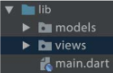

#### Pengerjaan:
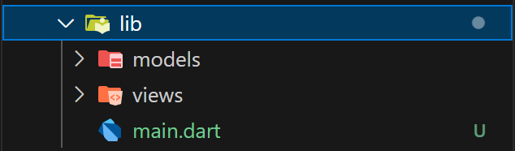


### **Langkah 2: Membuat model task.dart**
Praktik terbaik untuk memulai adalah pada lapisan data (*data layer*). Ini akan memberi Anda gambaran yang jelas tentang aplikasi Anda, tanpa masuk ke detail antarmuka pengguna Anda. Di folder model, buat file bernama `task.dart` dan buat `class Task`. Class ini memiliki atribut `description` dengan tipe data String dan `complete` dengan tipe data Boolean, serta ada konstruktor. Kelas ini akan menyimpan data tugas untuk aplikasi kita.

#### Pengerjaan:
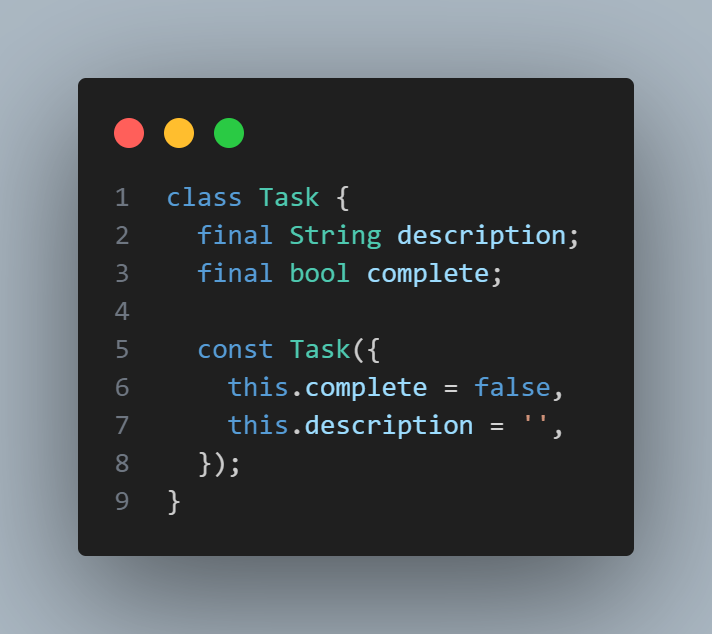


### **Langkah 3: Buat file plan.dart**
Kita juga perlu sebuah List untuk menyimpan daftar rencana dalam aplikasi to-do ini. Buat file `plan.dart` di dalam folder **models** dan isi kode seperti berikut.

#### Pengerjaan:
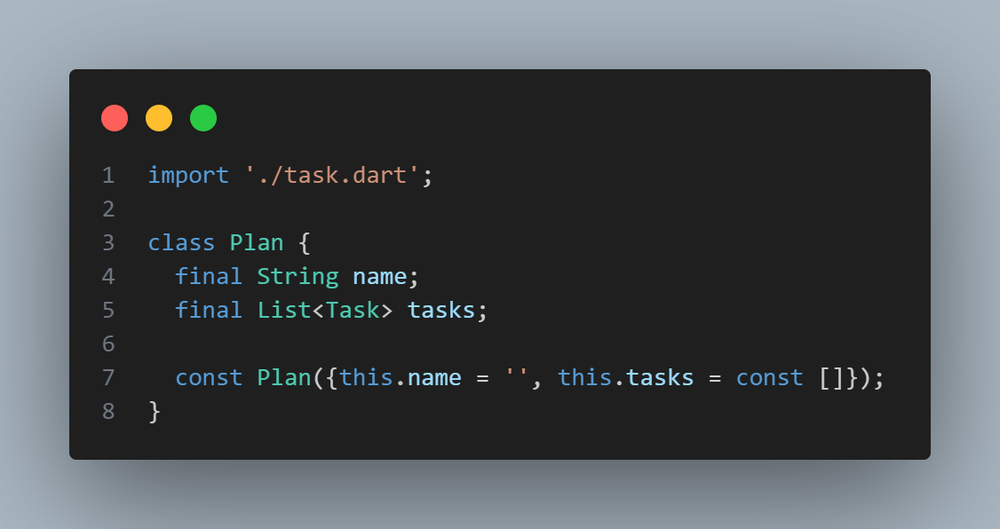


### **Langkah 4: Buat file data_layer.dart**
Kita dapat membungkus beberapa data layer ke dalam sebuah file yang nanti akan mengekspor kedua model tersebut. Dengan begitu, proses impor akan lebih ringkas seiring berkembangnya aplikasi. Buat file bernama `data_layer.dart` di folder **models**. Kodenya hanya berisi `export` seperti berikut.

#### Pengerjaan:
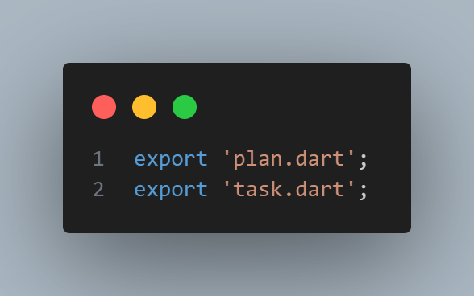


### **Langkah 5: Pindah ke file main.dart**
Ubah isi kode `main.dart` sebagai berikut.

#### Pengerjaan:
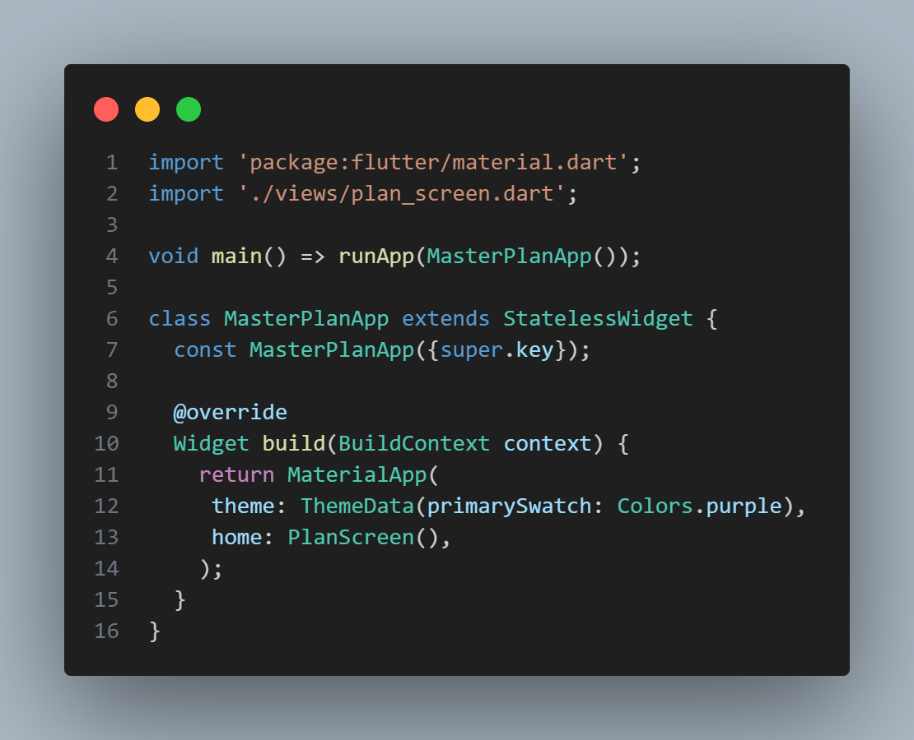


### **Langkah 6: buat plan_screen.dart**
Pada folder `views`, buatlah sebuah file `plan_screen.dart` dan gunakan templat `StatefulWidget` untuk membuat `class PlanScreen`. Isi kodenya adalah sebagai berikut. Gantilah teks **‘Namaku'** dengan nama panggilan Anda pada `title AppBar`.

#### Pengerjaan:
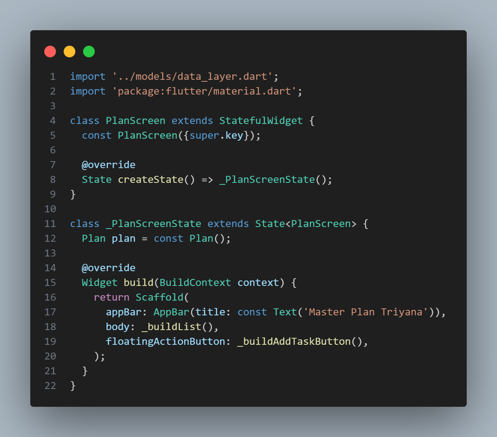


### **Langkah 7: buat method _buildAddTaskButton()**
Anda akan melihat beberapa error di langkah 6, karena method yang belum dibuat. Ayo kita buat mulai dari yang paling mudah yaitu tombol **Tambah Rencana**. Tambah kode berikut di bawah method `build` di dalam `class _PlanScreenState`.

#### Pengerjaan:
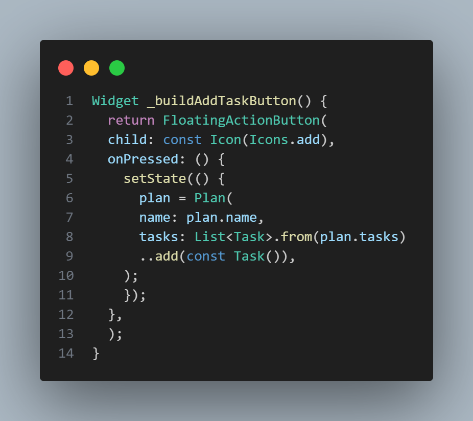


### **Langkah 8: buat widget _buildList()**
Kita akan buat widget berupa `List` yang dapat dilakukan scroll, yaitu `ListView.builder`. Buat widget `ListView` seperti kode berikut ini.

#### Pengerjaan:
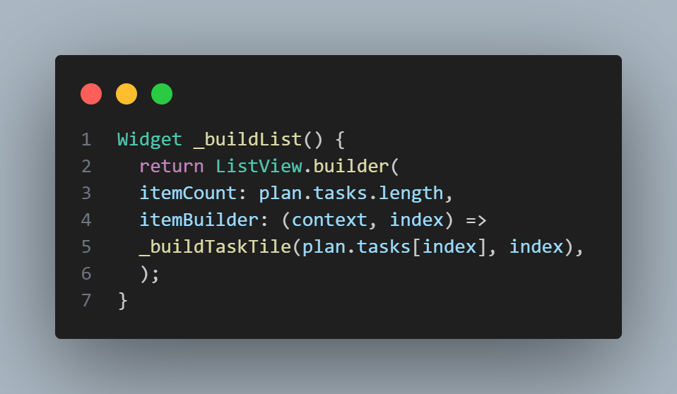


### **Langkah 9: buat widget _buildTaskTile**
Dari langkah 8, kita butuh `ListTile` untuk menampilkan setiap nilai dari `plan.tasks`. Kita buat dinamis untuk setiap `index` data, sehingga membuat `view` menjadi lebih mudah. Tambahkan kode berikut ini.

#### Pengerjaan:
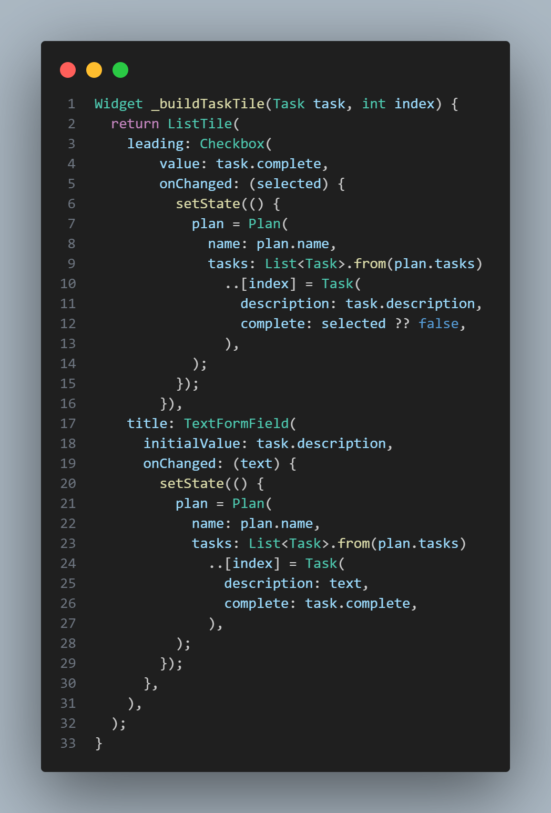

<br>

**Run** atau tekan **F5** untuk melihat hasil aplikasi yang Anda telah buat. Capture hasilnya untuk soal praktikum nomor 4.
#### Hasil:
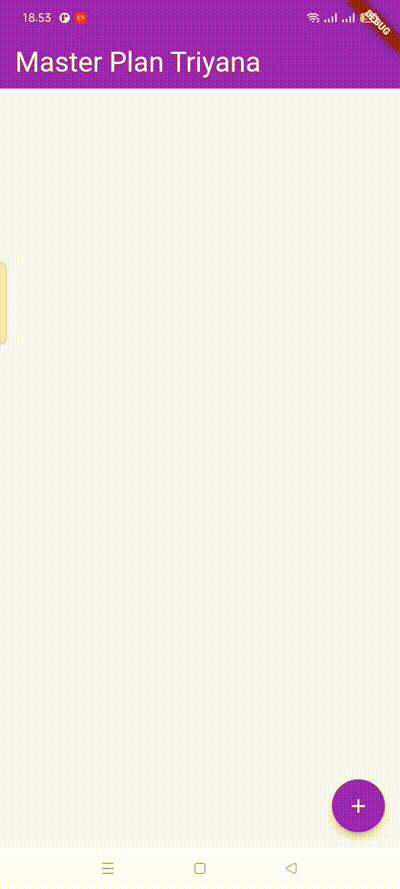


### **Langkah 10: Tambah Scroll Controller**
Anda dapat menambah tugas sebanyak-banyaknya, menandainya jika sudah beres, dan melakukan scroll jika sudah semakin banyak isinya. Namun, ada salah satu fitur tertentu di iOS perlu kita tambahkan. Ketika keyboard tampil, Anda akan kesulitan untuk mengisi yang paling bawah. Untuk mengatasi itu, Anda dapat menggunakan `ScrollController` untuk menghapus focus dari semua `TextField` selama event scroll dilakukan. Pada file `plan_screen.dart`, tambahkan variabel scroll controller di class State tepat setelah variabel `plan`.

#### Pengerjaan:
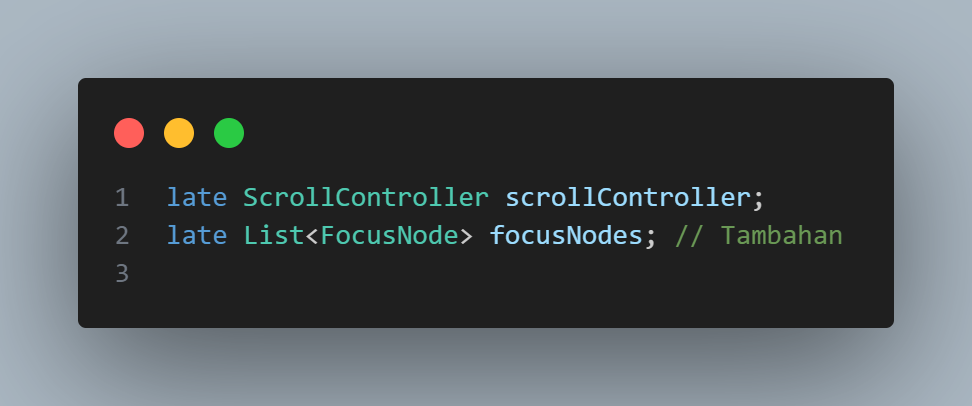


### **Langkah 11: Tambah Scroll Listener**
Tambahkan method `initState()` setelah deklarasi variabel `scrollController` seperti kode berikut.

#### Pengerjaan:
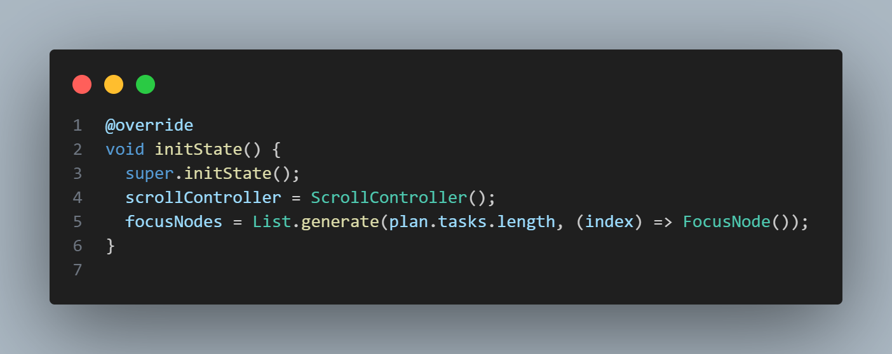


### **Langkah 12: Tambah controller dan keyboard behavior**
Tambahkan controller dan keyboard behavior pada ListView di method `_buildList` seperti kode berikut ini.

#### Pengerjaan:
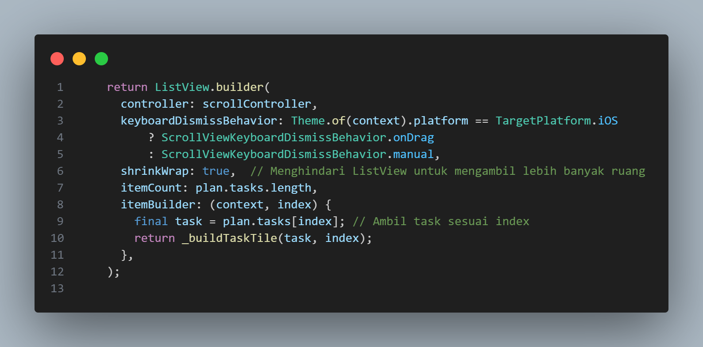


### **Langkah 13: Terakhir, tambah method dispose()**
Terakhir, tambahkan method `dispose()` berguna ketika widget sudah tidak digunakan lagi.

#### Pengerjaan:
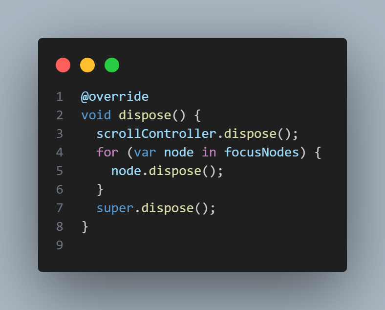


### **Langkah 14: Hasil**
Lakukan Hot restart (`bukan` hot reload) pada aplikasi Flutter Anda. Anda akan melihat tampilan akhir seperti gambar berikut. Jika masih terdapat error, silakan diperbaiki hingga bisa running.
#### Hasil Praktikum 1:


<br>

> **Catatan:** Kedua fitur hot reload dan hot restart memiliki performa lebih cepat dibanding melakukan build ulang secara keseluruhan aplikasi. Secara umum:
> 
> - Gunakan *hot reload* untuk melihat perubahan pada tampilan UI, jadi perubahan paling banyak terjadi di metode *build*. State pada aplikasi tetap dipertahankan dan Anda akan melihat perubahannya hampir secara instan.
> - Gunakan *hot restart* untuk melihat perubahan pada state aplikasi, seperti memperbarui **variabel global, static fields**, atau metode `main()`. Kondisi app state akan reset (kembali seperti awal).


## **Tugas Praktikum 1: Dasar State dengan Model-View**
1. Selesaikan langkah-langkah praktikum tersebut, lalu dokumentasikan berupa GIF hasil akhir praktikum beserta penjelasannya di file `README.md`! Jika Anda menemukan ada yang error atau tidak berjalan dengan baik, silakan diperbaiki.

<br>

2. Jelaskan maksud dari langkah 4 pada praktikum tersebut! Mengapa dilakukan demikian? <br>
**Jawaban:** <br>
Langkah 4 : 
    ``` dart
    export 'plan.dart';
    export 'task.dart';
    ```
    Langkah 4 dibuat untuk mempermudah impor model plan.dart dan task.dart ke dalam aplikasi. Dengan membungkus kedua model ini dalam satu file data_layer.dart, kita hanya perlu menulis satu kali perintah impor (import 'data_layer.dart';) di berbagai file yang memerlukannya. Hal ini membuat kode lebih rapi karena tidak perlu mengimpor plan.dart dan task.dart secara terpisah di setiap file yang membutuhkan mereka.

<br>

3. Mengapa perlu variabel plan di langkah 6 pada praktikum tersebut? Mengapa dibuat konstanta ? <br>
**Jawaban:** <br>
    ``` dart
    Plan plan = const Plan();
    ```
    Variabel plan di langkah 6 digunakan untuk menyimpan data rencana atau daftar tugas yang akan ditampilkan dan dikelola pada tampilan PlanScreen. Variabel ini menyimpan instance dari kelas Plan, yang berisi daftar objek Task.

<br>

4. Lakukan capture hasil dari Langkah 9 berupa GIF, kemudian jelaskan apa yang telah Anda buat! <br>
**Jawaban:** <br>
 <br>
Pada Praktikum 1, saya telah membuat aplikasi Flutter sederhana untuk daftar tugas (to-do list). Aplikasi ini memiliki beberapa fitur utama, yaitu:
    - Menambah Tugas: Pengguna dapat menambahkan tugas baru ke daftar dengan menekan tombol "+".
    - Mengedit Tugas: Setiap tugas dapat diubah deskripsinya melalui kolom teks yang tersedia.
    - Menandai Tugas Selesai: Pengguna dapat menandai tugas sebagai selesai atau belum selesai dengan menggunakan kotak centang.
    - Kemudahan Scroll dan Keyboard: Daftar tugas dapat di-scroll dengan lancar, dan pada perangkat iOS, keyboard akan otomatis tertutup saat daftar digulir. <br>
    Aplikasi ini dirancang dengan pemisahan antara data dan tampilan menggunakan pendekatan Model-View, memastikan pengelolaan state yang lebih terstruktur.

<br>

5. Apa kegunaan method pada Langkah 11 dan 13 dalam *lifecyle state*? <br>
**Jawaban:** <br>
Pada Praktikum 1, langkah 11 dan 13 menggunakan dua metode *lifecycle state* penting dalam Flutter: `initState()` dan `dispose()`. Berikut kegunaannya:

    **Langkah 11 - initState():**
    <br>

    - initState() dipanggil sekali ketika widget pertama kali dibuat, sebelum tampilannya dirender.
    - Dalam langkah ini, initState() digunakan untuk menginisialisasi ScrollController dan menambahkan listener untuk mendeteksi saat pengguna melakukan scroll. Listener ini berguna untuk menghilangkan fokus dari TextField saat scrolling, sehingga keyboard akan menutup otomatis saat daftar tugas di-scroll.

    **Langkah 13 - dispose():**
    <br>

    - dispose() adalah metode terakhir yang dipanggil saat widget dihapus dari widget tree.
    - Dalam langkah ini, dispose() digunakan untuk membersihkan atau membuang ScrollController ketika widget sudah tidak diperlukan lagi. Hal ini penting untuk menghindari kebocoran memori (memory leaks), memastikan aplikasi berjalan lebih efisien.

<br>

6. Kumpulkan laporan praktikum Anda berupa link commit atau repository GitHub ke dosen yang telah disepakati !


---
---


## **Praktikum 2: Mengelola Data Layer dengan InheritedWidget dan InheritedNotifier**

### **Langkah 1: Buat file plan_provider.dart**
Buat folder baru `provider` di dalam folder `lib`, lalu buat file baru dengan nama `plan_provider.dart` berisi kode seperti berikut.

#### Pengerjaan:
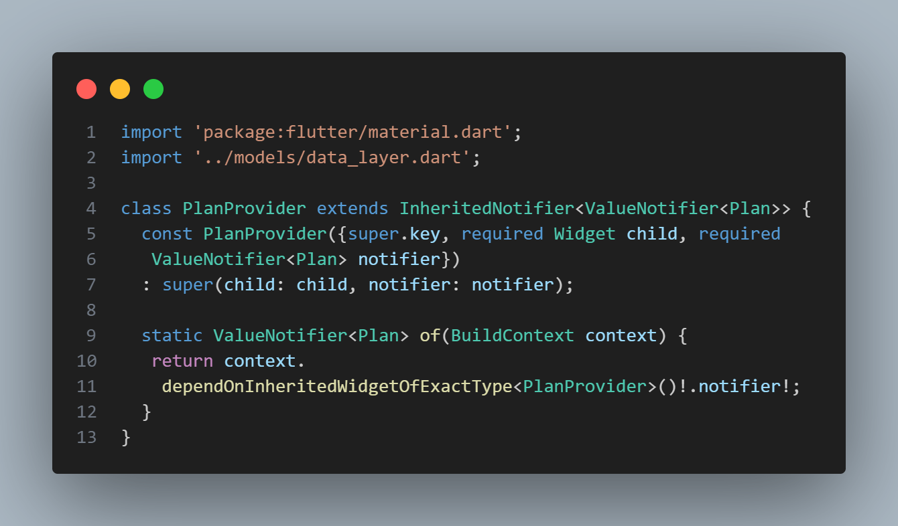


### **Langkah 2: Edit main.dart**
Gantilah pada bagian atribut `home` dengan `PlanProvider` seperti berikut. Jangan lupa sesuaikan bagian impor jika dibutuhkan.

#### Pengerjaan:
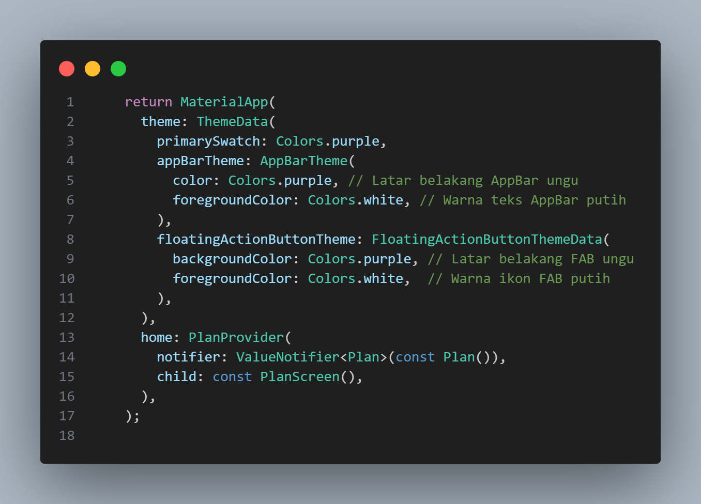


### **Langkah 3: Tambah method pada model plan.dart**
Tambahkan dua *method* di dalam model `class Plan` seperti kode berikut.

#### Pengerjaan:
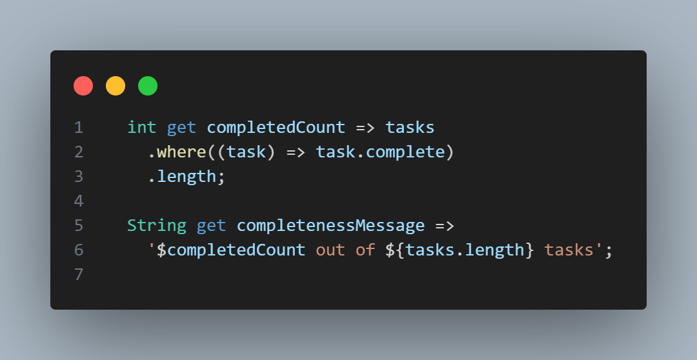


### **Langkah 4: Pindah ke PlanScreen**
Edit `PlanScreen` agar menggunakan data dari `PlanProvider`. Hapus deklarasi variabel `plan` (ini akan membuat error). Kita akan perbaiki pada langkah 5 berikut ini.


### **Langkah 5: Edit method _buildAddTaskButton**
Tambahkan `BuildContext` sebagai parameter dan gunakan `PlanProvider` sebagai sumber datanya. Edit bagian kode seperti berikut.

#### Pengerjaan:
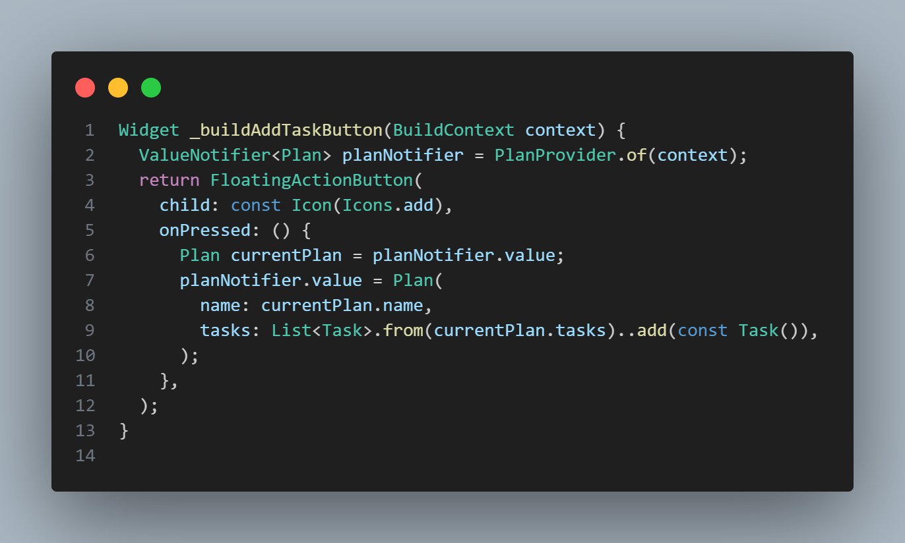


### **Langkah 6: Edit method _buildTaskTile**
Tambahkan parameter `BuildContext`, gunakan `PlanProvider` sebagai sumber data. Ganti `TextField` menjadi `TextFormField` untuk membuat inisial `data provider` menjadi lebih mudah.

#### Pengerjaan:
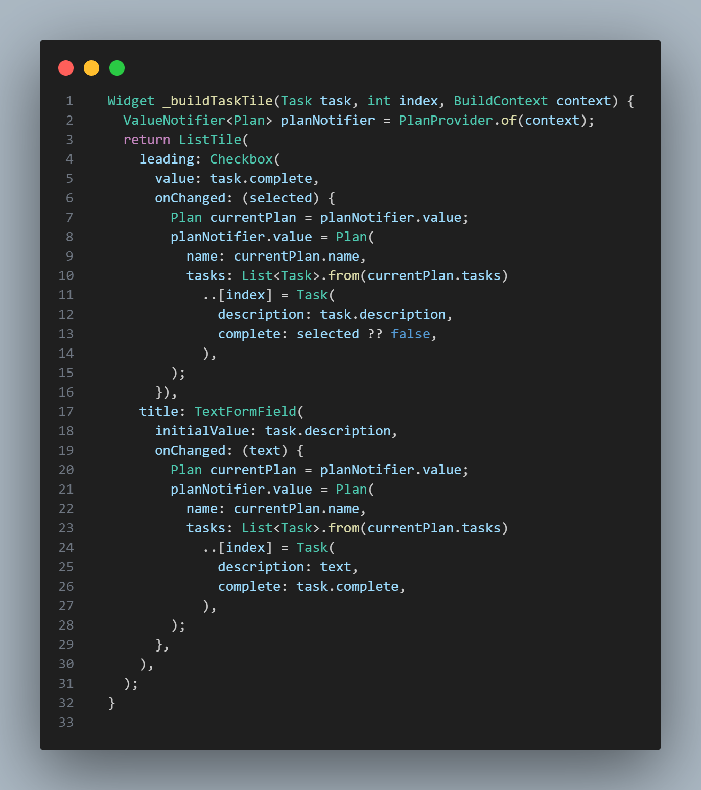


### **Langkah 7: Edit _buildList**
Sesuaikan parameter pada bagian `_buildTaskTile` seperti kode berikut.

#### Pengerjaan:
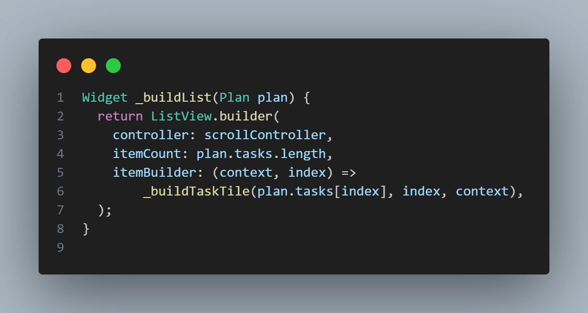


### **Langkah 8: Tetap di class PlanScreen**
Edit method build sehingga bisa tampil progress pada bagian bawah (footer). Caranya, bungkus (wrap) _buildList dengan widget Expanded dan masukkan ke dalam widget Column seperti kode pada Langkah 9.


### **Langkah 9: Tambah widget SafeArea**
Terakhir, tambahkan widget `SafeArea` dengan berisi `completenessMessage` pada akhir widget `Column`. Perhatikan kode berikut ini.

#### Pengerjaan:
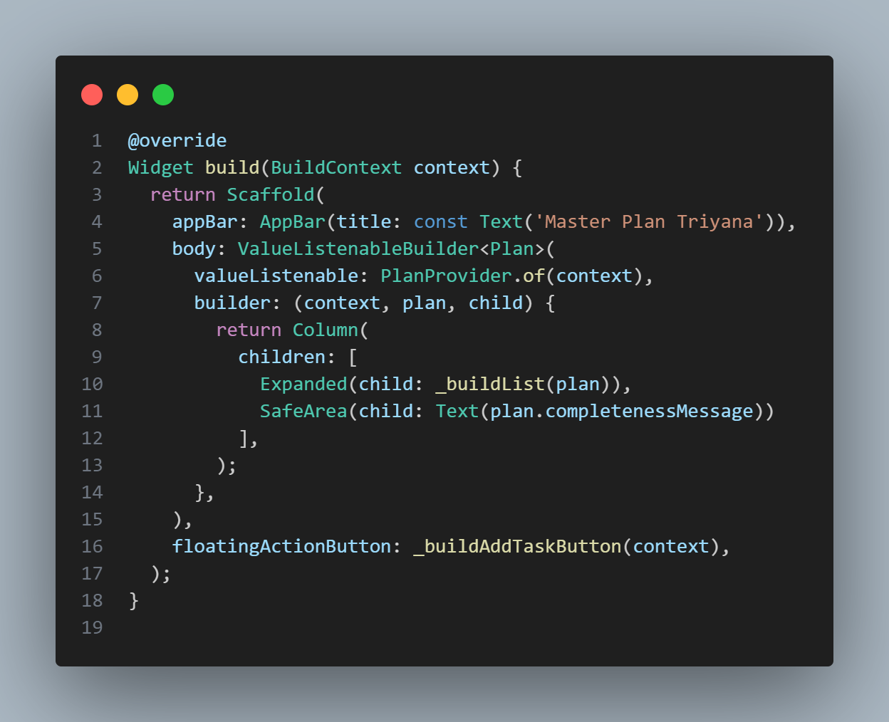


Akhirnya, **run** atau tekan **F5** jika aplikasi belum running. Tidak akan terlihat perubahan pada UI, namun dengan melakukan langkah-langkah di atas, Anda telah menerapkan cara memisahkan dengan baik antara **view** dan **model**. Ini merupakan hal terpenting dalam mengelola **state** di aplikasi Anda.

### Hasil Praktikum 2:
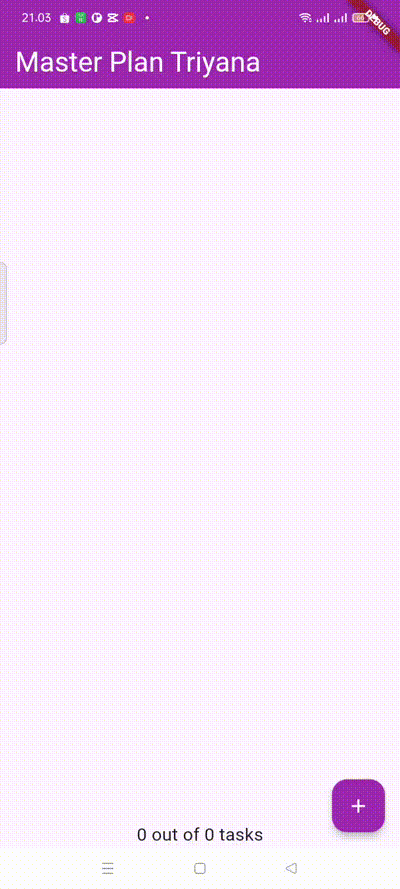


## **Tugas Praktikum 2: InheritedWidget**
1. Selesaikan langkah-langkah praktikum tersebut, lalu dokumentasikan berupa GIF hasil akhir praktikum beserta penjelasannya di file `README.md`! Jika Anda menemukan ada yang error atau tidak berjalan dengan baik, silakan diperbaiki sesuai dengan tujuan aplikasi tersebut dibuat.

<br>

2. Jelaskan mana yang dimaksud `InheritedWidget` pada langkah 1 tersebut! Mengapa yang digunakan `InheritedNotifier`? <br>
**Jawaban:** <br>
Pada langkah 1, InheritedWidget yang dimaksud adalah PlanProvider. PlanProvider ini bukan langsung menggunakan InheritedWidget tetapi memanfaatkan InheritedNotifier, yang merupakan subclass dari InheritedWidget. InheritedNotifier memungkinkan widget turunannya menerima notifikasi setiap kali ada perubahan pada ValueNotifier. InheritedNotifier dipilih karena memberikan mekanisme pengelolaan state yang lebih efisien: widget tidak perlu di-refresh secara manual saat ada perubahan data karena ValueNotifier akan mengatur notifikasi pembaruan secara otomatis.

<br>

3. Jelaskan maksud dari method di langkah 3 pada praktikum tersebut! Mengapa dilakukan demikian? <br>
**Jawaban:** <br>
Pada langkah 3, dua method (completedCount dan completenessMessage) ditambahkan ke model Plan untuk menghitung jumlah tugas yang selesai dan menampilkan pesan progres secara ringkas: <br>
    - completedCount: Menghitung jumlah tugas yang sudah selesai di dalam tasks.
    - completenessMessage: Membuat pesan ringkas tentang progres, misalnya "3 out of 5 tasks". <br>
    Dengan memasukkan logika penghitungan progres ke dalam model Plan, kita menghindari pengulangan logika ini di berbagai widget tampilan. Alhasil, tampilan di PlanScreen dapat mengakses dan menampilkan progres hanya dengan mengambil completenessMessage dari Plan, tanpa memerlukan logika tambahan untuk penghitungan ini.

<br>

4. Lakukan capture hasil dari Langkah 9 berupa GIF, kemudian jelaskan apa yang telah Anda buat! <br>
**Jawaban:** <br>
 <br>
Pada praktikum ini, saya membuat aplikasi to-do list sederhana di Flutter yang menampilkan progres tugas. Menggunakan InheritedNotifier dalam PlanProvider, aplikasi ini memisahkan data dari tampilan, memungkinkan update otomatis setiap kali data berubah.
<br>
Di tampilan utama (PlanScreen), pengguna dapat menambah tugas dan menandai tugas selesai. Progres tugas ditampilkan di bagian bawah menggunakan completenessMessage, yang diperbarui secara otomatis setiap kali ada perubahan pada daftar tugas.
<br>
Dengan memanfaatkan PlanProvider, aplikasi ini menjadi lebih modular dan responsif terhadap perubahan data.

<br>

5. Kumpulkan laporan praktikum Anda berupa link commit atau repository GitHub ke dosen yang telah disepakati !


---
---


## **Praktikum 3: Membuat State di Multiple Screens**

### **Langkah 1: Edit PlanProvider**
Perhatikan kode berikut, edit class `PlanProvider` sehingga dapat menangani List Plan.

#### Pengerjaan:
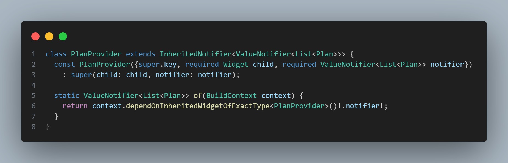


### **Langkah 2: Edit main.dart**
Langkah sebelumnya dapat menyebabkan error pada `main.dart` dan `plan_screen.dart`. Pada method `build`, gantilah menjadi kode seperti ini.

#### Pengerjaan:
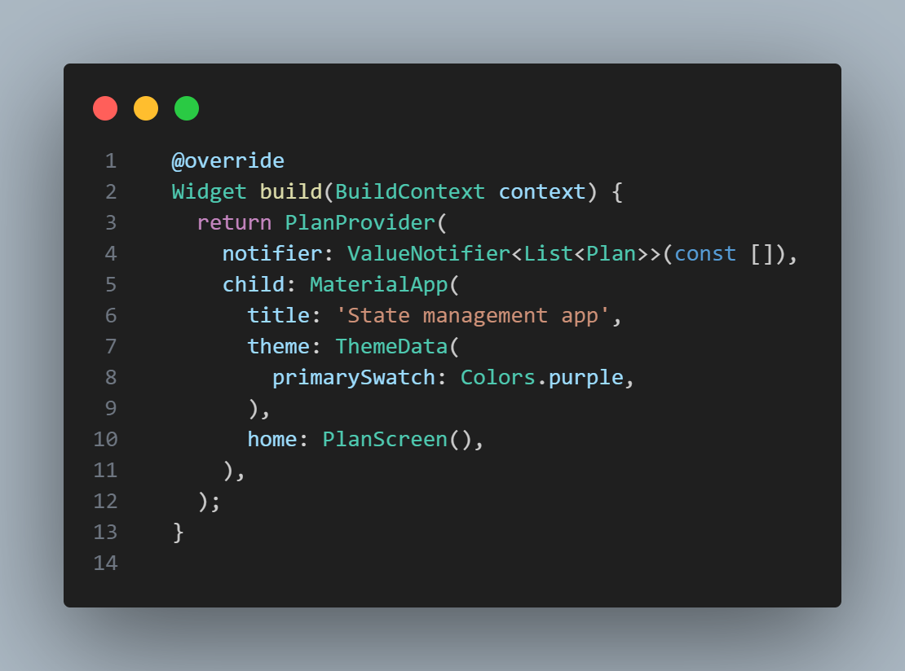


### **Langkah 3: Edit plan_screen.dart**
Tambahkan variabel `plan` dan atribut pada *constructor*-nya seperti berikut.

#### Pengerjaan:
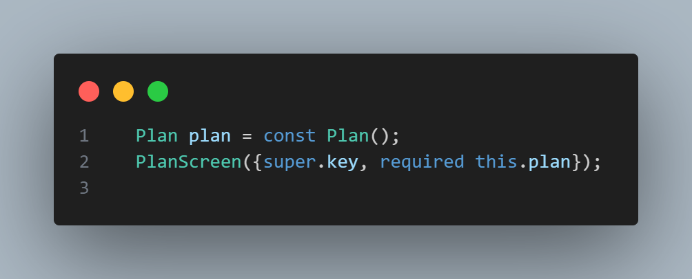


### **Langkah 4: Error**
Itu akan terjadi error setiap kali memanggil `PlanProvider.of(context)`. Itu terjadi karena screen saat ini hanya menerima tugas-tugas untuk satu kelompok `Plan`, tapi sekarang `PlanProvider` menjadi list dari objek plan tersebut.


### **Langkah 5: Tambah getter Plan**
Tambahkan getter pada `_PlanScreenState` seperti kode berikut.

#### Pengerjaan:
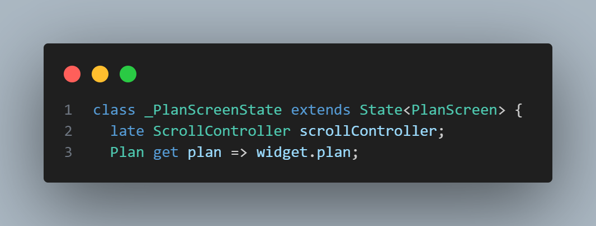


### **Langkah 6: Method initState()**
Pada bagian ini kode tetap seperti berikut.

#### Pengerjaan:
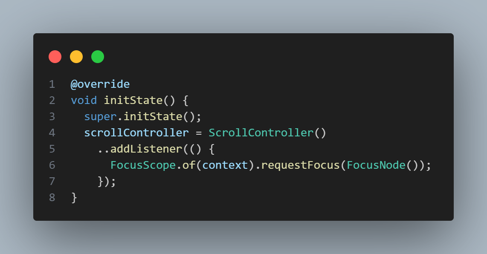


### **Langkah 7: Widget build**
Pastikan Anda telah merubah ke `List` dan mengubah nilai pada `currentPlan` seperti kode berikut ini.

#### Pengerjaan:
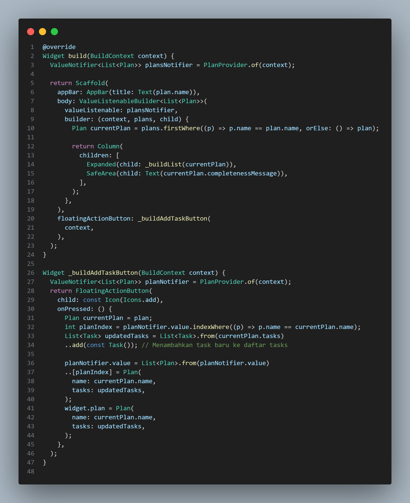


### **Langkah 8: Edit _buildTaskTile**
Pastikan ubah ke `List` dan variabel `planNotifier` seperti kode berikut ini.

#### Pengerjaan:
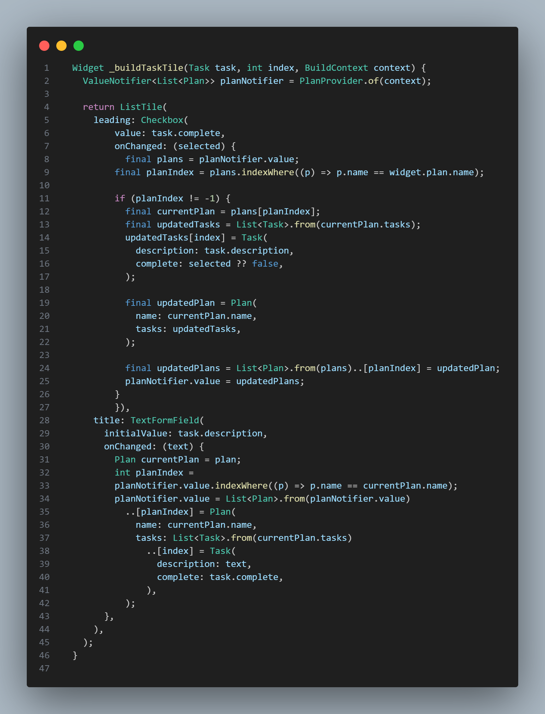


### **Langkah 9: Buat screen baru**
Pada folder **view**, buatlah file baru dengan nama `plan_creator_screen.dart` dan deklarasikan dengan `StatefulWidget` bernama `PlanCreatorScreen`. Gantilah di `main.dart` pada atribut home menjadi seperti berikut.

#### Pengerjaan:
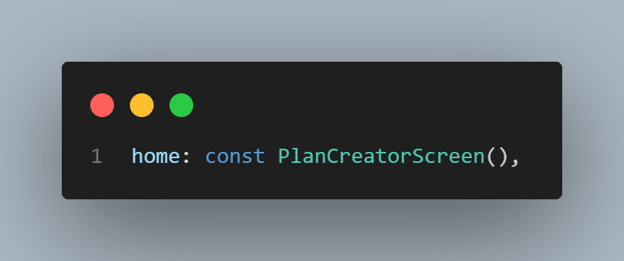


### **Langkah 10: Pindah ke class _PlanCreatorScreenState**
Kita perlu tambahkan variabel `TextEditingController` sehingga bisa membuat `TextField` sederhana untuk menambah Plan baru. Jangan lupa tambahkan dispose ketika widget unmounted seperti kode berikut.

#### Pengerjaan:
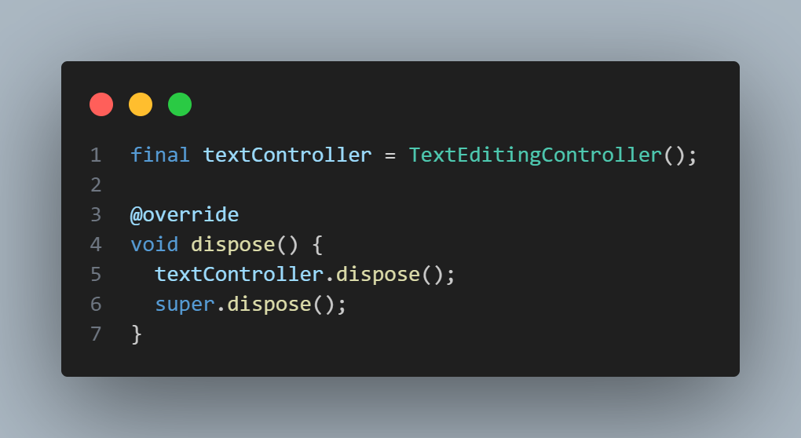


### **Langkah 11: Pindah ke method build**
Letakkan method Widget `build` berikut di atas `void dispose`. Gantilah **‘Namaku'** dengan nama panggilan Anda.

#### Pengerjaan:
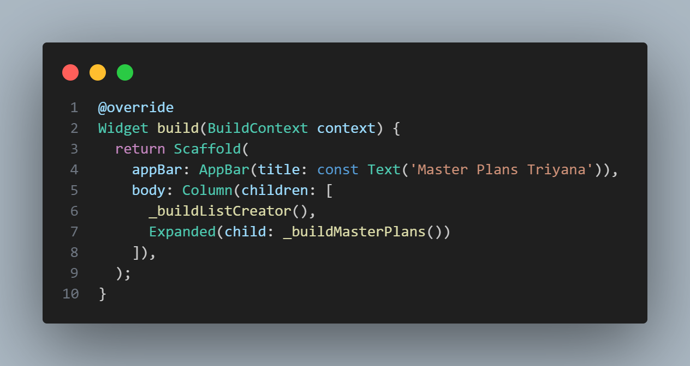


### **Langkah 12: Buat widget _buildListCreator**
Buatlah widget berikut setelah widget build.

#### Pengerjaan:
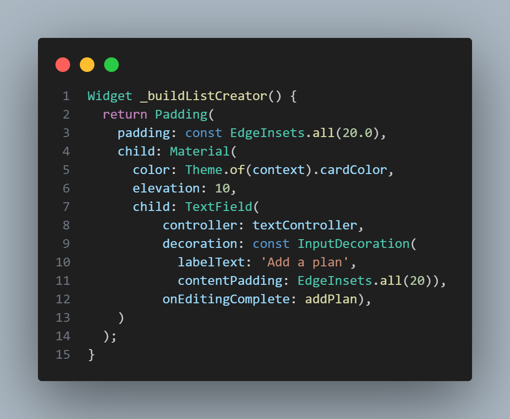


### **Langkah 13: Buat void addPlan()**
Tambahkan method berikut untuk menerima inputan dari user berupa text plan.

#### Pengerjaan:
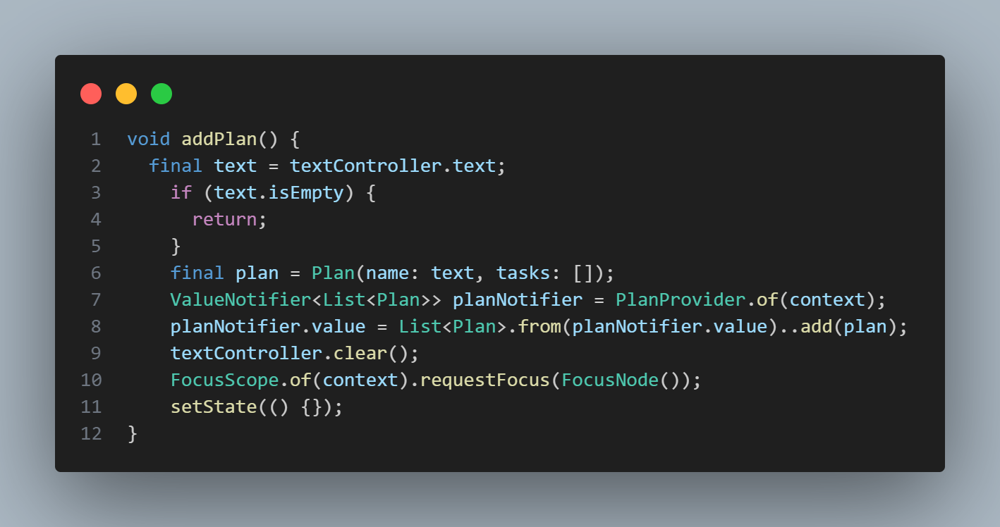


### **Langkah 14: Buat widget _buildMasterPlans()**
Tambahkan widget seperti kode berikut.

#### Pengerjaan:
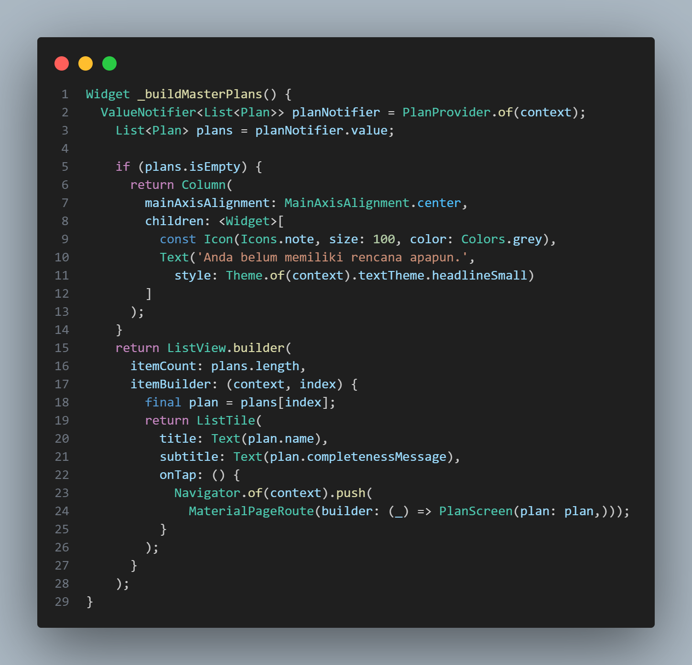


Terakhir, **run** atau tekan **F5** untuk melihat hasilnya jika memang belum running. Bisa juga lakukan **hot restart** jika aplikasi sudah running. Maka hasilnya akan seperti gambar berikut ini.

### Hasil Praktikum 3:


## **Tugas Praktikum 3: State di Multiple Screens**
1. Selesaikan langkah-langkah praktikum tersebut, lalu dokumentasikan berupa GIF hasil akhir praktikum beserta penjelasannya di file `README.md`! Jika Anda menemukan ada yang error atau tidak berjalan dengan baik, silakan diperbaiki sesuai dengan tujuan aplikasi tersebut dibuat.

<br>

2. Berdasarkan Praktikum 3 yang telah Anda lakukan, jelaskan maksud dari gambar diagram berikut ini!
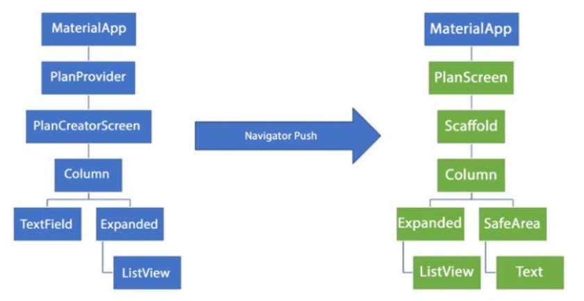
<br>

    **Jawaban:** <br>
    Diagram ini menunjukkan dua layar utama dalam aplikasi Flutter, yaitu layar pembuat rencana (PlanCreatorScreen) dan layar detail rencana (PlanScreen), serta bagaimana aplikasi berpindah dari satu layar ke layar lainnya menggunakan Navigator.push.
    <br>

    Layar Kiri - PlanCreatorScreen:
    - Layar ini adalah layar awal di mana pengguna bisa membuat daftar rencana (plans).
    - MaterialApp adalah root aplikasi yang membungkus seluruh widget.
    - PlanProvider mengelola data semua rencana yang telah dibuat agar bisa diakses di seluruh aplikasi.
    - PlanCreatorScreen adalah layar untuk menambah rencana baru. Di dalamnya ada:
        - TextField untuk memasukkan nama rencana.
        - ListView (dibungkus oleh Expanded) untuk menampilkan daftar rencana yang telah dibuat.
    <br>

    **Proses Navigasi - Navigator Push:**
    - Ketika pengguna memilih rencana dari daftar di PlanCreatorScreen, aplikasi akan menggunakan Navigator.push untuk berpindah ke PlanScreen.
    - Navigator.push berarti kita berpindah ke layar baru, yaitu layar detail dari rencana yang dipilih.
    <br>

    **Layar Kanan - PlanScreen:**
    - Ini adalah layar detail yang menunjukkan isi dari rencana yang dipilih oleh pengguna.
    - PlanScreen adalah halaman yang menampilkan detail dari satu rencana yang dipilih. Di dalamnya ada:
        - ListView untuk menampilkan daftar tugas dalam rencana.
        - SafeArea dengan teks yang menunjukkan kemajuan atau status rencana.
    <br>

    Jadi, diagram ini memperlihatkan dua layar utama aplikasi dan bagaimana data rencana dipindahkan dari satu layar ke layar lainnya melalui navigasi.

<br>

3. Lakukan capture hasil dari Langkah 14 berupa GIF, kemudian jelaskan apa yang telah Anda buat! <br>
**Jawaban:** <br>

Pada praktikum 3 ini, saya telah membuat aplikasi Flutter dengan dua layar utama untuk mengelola rencana (plans) dan tugas-tugas di dalamnya, menggunakan InheritedWidget untuk manajemen state. Berikut fiturnya:
    - PlanCreatorScreen (Layar Utama): Pengguna bisa menambahkan rencana baru melalui kolom input teks. Daftar rencana ditampilkan di bawahnya, dan setiap rencana bisa dipilih untuk melihat detailnya.
    - PlanScreen (Layar Detail): Menampilkan tugas-tugas dari rencana yang dipilih. Pengguna bisa menandai tugas sebagai selesai, menambah tugas baru, atau mengedit deskripsi tugas.
    <br>
    Fitur ini menunjukkan manajemen state dengan InheritedWidget dan navigasi antar layar menggunakan Navigator.push, sehingga data tetap konsisten di seluruh aplikasi.

<br>

4. Kumpulkan laporan praktikum Anda berupa link commit atau repository GitHub ke dosen yang telah disepakati !