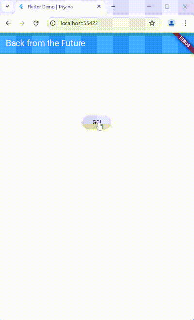
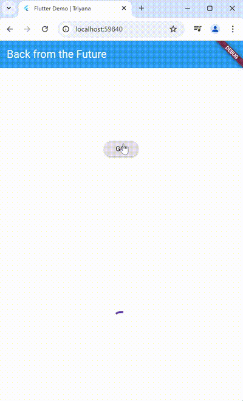
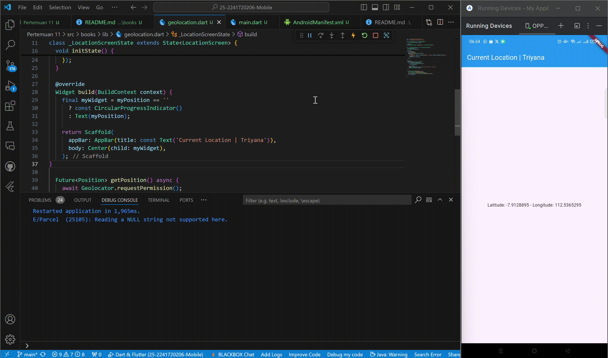
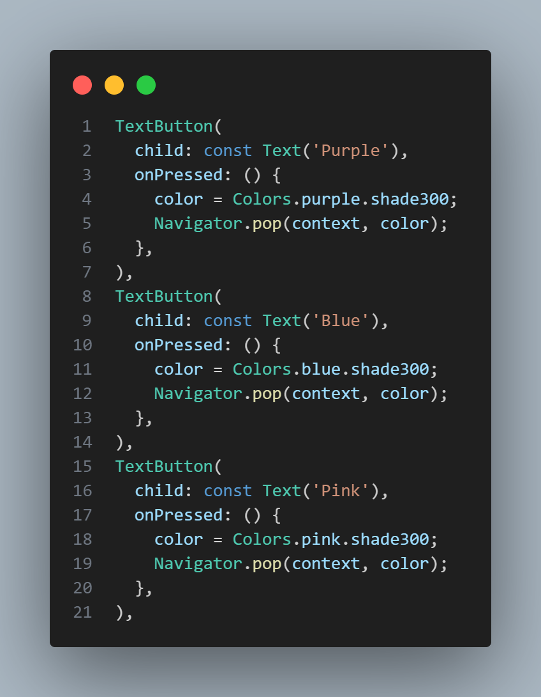

# **Pertemuan 11 | Pemrograman Asynchronous**
## Identitas Mahasiswa

> Nama  : Triyana Dewi Fatmawati  
> NIM   : 2241720206  
> Kelas : TI - 3H  
> Nomor : 25  

---
**Link Laporan Praktikum dan Soal:**  

## **Praktikum 1**
### **Soal 1**  
Tambahkan **nama panggilan** Anda pada `title` app sebagai identitas hasil pekerjaan Anda. 

#### **Pengerjaan:**
  

### **Soal 2**  
- Carilah judul buku favorit Anda di Google Books, lalu ganti ID buku pada variabel path di kode tersebut. Caranya ambil di URL browser Anda seperti gambar berikut ini.  

- Kemudian cobalah akses di browser URI tersebut dengan lengkap seperti ini. Jika menampilkan data JSON, maka Anda telah berhasil.  
  

#### **Pengerjaan:**  
  
  

### **Soal 3**  
Jelaskan maksud kode langkah 5 tersebut terkait `substring` dan `catchError`!
#### **Jawaban:**  
- **substring** digunakan untuk membatasi panjang teks yang ditampilkan, karena data yang dikembalikan dari API bisa sangat panjang. Sebagai contoh pada kode langkah 5 `substring(0, 450)` yang berarti mengambil sebagian dari teks mulai dari indeks ke-0 hingga ke-449 (450 karakter pertama).
- **catchError** berfungsi menangkap kesalahan (error) yang terjadi selama pemanggilan Future (proses getData()).

### **Hasil Akhir Praktikum 1**  

 
 

---

## **Praktikum 2**
### **Soal 4**  
Jelaskan maksud kode langkah 1 dan 2 tersebut!  
#### **Jawaban:**
**Langkah 1:**
- Tipe Return Future<int>:  
Method asinkron (async) yang mengembalikan nilai bertipe int di masa depan setelah operasi selesai.  
- Future.delayed:  
Membuat simulasi penundaan selama 3 detik sebelum nilai dikembalikan. Berguna untuk menguji atau mensimulasikan proses yang memerlukan waktu, seperti pengambilan data dari API atau database.  
- Fungsi Masing-Masing Method:  
  - returnOneAsync: Mengembalikan angka 1 setelah 3 detik.  
  - returnTwoAsync: Mengembalikan angka 2 setelah 3 detik.  
  - returnThreeAsync: Mengembalikan angka 3 setelah 3 detik.
 

**Langkah 2:**
- Tipe Return Future:  
Method ini adalah fungsi asinkron tanpa nilai kembalian (void), tetapi tetap berjalan secara asinkron.  
- Menggunakan await:  
await digunakan untuk menunggu hasil masing-masing method (returnOneAsync, returnTwoAsync, returnThreeAsync) sebelum melanjutkan eksekusi ke baris berikutnya. 
Eksekusi berjalan secara sekuensial:
  - Menunggu 3 detik untuk mendapatkan angka 1.
  - Menunggu 3 detik lagi untuk angka 2.
  - Menunggu 3 detik lagi untuk angka 3.
- Menghitung Total:  
Hasil dari masing-masing method dijumlahkan:  
total = 1 + 2 + 3.  
Totalnya adalah 6 setelah semua proses selesai.  
- Memperbarui UI dengan setState:  
Nilai result diatur menjadi string total (6) menggunakan setState.
Memastikan UI diperbarui dengan nilai terbaru setelah proses selesai.  
 

**Ilustrasi Eksekusi**  
- returnOneAsync dijalankan (menunggu 3 detik, menghasilkan 1).
- returnTwoAsync dijalankan (menunggu 3 detik, menghasilkan 2).
- returnThreeAsync dijalankan (menunggu 3 detik, menghasilkan 3).
- Total dihitung: 1 + 2 + 3 = 6.
- Nilai total (6) ditampilkan di layar.  
- Total waktu eksekusi adalah 9 detik karena proses berjalan berurutan (sekuensial).  
 

### **Hasil Akhir Praktikum 2**

 

---

## **Praktikum 3**
### **Soal 5**
Jelaskan maksud kode langkah 2 tersebut!

#### **Jawaban:**
Kode pada langkah 2 menambahkan variabel late `completer`, method `getNumber`, dan method `calculate`.  

**Completer** adalah kelas di Dart yang digunakan untuk mengontrol penyelesaian (completion) sebuah Future secara manual. Dengan Completer, kita dapat menentukan kapan dan bagaimana sebuah Future selesai, baik dengan nilai sukses (complete) maupun kesalahan (completeError). Variabel completer dideklarasikan sebagai late, yang berarti Variabel akan diinisialisasi nanti sebelum digunakan.
 

**Method getNumber**  
- completer = Completer<int>()  
Membuat instance baru dari Completer yang akan menyelesaikan sebuah Future bertipe int.  
- calculate();  
Memulai proses perhitungan asinkron. Hasil perhitungan ini akan melengkapi (complete) Future yang dihasilkan oleh Completer.  
- return completer.future;  
Mengembalikan Future yang terkait dengan Completer. Future ini digunakan oleh kode pemanggil untuk menunggu hasil perhitungan.
 

**Method calculate**  
- await Future.delayed  
Mensimulasikan proses yang memakan waktu, seperti perhitungan atau pengambilan data, dengan penundaan 5 detik.  
- completer.complete(42)  
Menyelesaikan Future yang terkait dengan Completer dan memberikan nilai 42 sebagai hasilnya.
 
 

Jadi, **Maksud kode pada langkah 2**:
1.  Mensimulasikan proses yang butuh waktu 5 detik (seperti menghitung sesuatu atau mengambil data).
2. Menggunakan Completer untuk mengatur kapan hasil proses selesai, sehingga kita bisa memberikan nilai hasil (yaitu angka 42) setelah proses selesai.
3. Mengembalikan nilai 42 sebagai hasil operasi setelah 5 detik.
 
 

### **Soal 6**
Jelaskan maksud perbedaan kode langkah 2 dengan langkah 5-6 tersebut!

#### **Jawaban:**
**Langkah 2:**  
- Kode hanya menangani keberhasilan (hasilnya selalu 42).
- Tidak ada penanganan jika terjadi error. Jika error muncul, aplikasi bisa crash.  

**Langkah 5-6:**  
- Menambahkan penanganan error dengan try-catch di calculate.
- Jika proses gagal, error ditangani dengan completer.completeError, dan catchError akan menampilkan pesan error ke pengguna.
- Jadi, kode lebih aman dan dapat menangani baik keberhasilan maupun kegagalan.  

**Intinya:** Langkah 5-6 membuat kode lebih aman karena dapat menangani keberhasilan maupun kegagalan proses, sehingga aplikasi tetap berjalan dengan baik meskipun terjadi error. Sementara itu, langkah 2 hanya cocok jika proses selalu berhasil, karena tidak ada penanganan error.
 
 

### **Hasil Akhir Praktikum 3**

 

---

## **Praktikum 4**
### **Soal 7**  
Capture hasil praktikum Anda berupa GIF dan lampirkan di README.  
#### **Pengerjaan:**  

 

### **Soal 8**
Jelaskan maksud perbedaan kode langkah 1 dan 4!  
#### **Jawaban:**  
**Kode langkah 1:**  
- FutureGroup digunakan untuk mengelola banyak Future dan menunggu hingga semua Future selesai.
- Menggunakan add untuk menambahkan Future.
- Harus memanggil close() setelah semua Future ditambahkan agar proses berjalan.
- Mengembalikan nilai berupa list hasil dari semua Future melalui future.  

**Kode langkah 4:**  
- Future.wait langsung menerima list dari semua Future yang ingin ditunggu.
- Tidak perlu add atau close seperti FutureGroup.
- Setelah semua Future selesai, hasil dikembalikan sebagai list dari nilai masing-masing Future.  

Jadi, Future.wait lebih sederhana dan langsung digunakan, cocok jika semua proses Future sudah diketahui sejak awal. Sementara itu, FutureGroup lebih fleksibel untuk menambahkan Future secara bertahap, tetapi lebih rumit karena harus menutup grup dengan close(). 

 

### **Hasil Akhir Praktikum 4**

 

---

## **Praktikum 5**
### **Soal 9**  
Capture hasil praktikum Anda berupa GIF dan lampirkan di README.  
#### **Pengerjaan:**  

 

### **Soal 10**
Panggil method handleError() tersebut di ElevatedButton, lalu run. Apa hasilnya? Jelaskan perbedaan kode langkah 1 dan 4!
#### **Jawaban:**  
  
Hasil setelah memanggil method handleError() ke ElevatedButton  

 

**Perbedaan kode langkah 1 dan 4 :**  
- Langkah 1 membuat method returnError() yang hanya mensimulasikan error dengan menunda proses selama 2 detik, lalu melemparkan pesan error tanpa penanganan. Jika error ini terjadi, aplikasi bisa langsung crash.
- Langkah 4 menambahkan method handleError() yang bertugas menangkap dan mengelola error dari returnError() menggunakan try-catch-finally. Di sini, error yang terjadi ditangkap di blok catch, lalu hasil error tersebut ditampilkan ke UI menggunakan setState. Blok finally memastikan kode tetap berjalan meskipun ada error, seperti mencetak pesan "Complete". Langkah 4 membuat aplikasi lebih aman dan tetap responsif meskipun ada error.

 

### **Hasil Akhir Praktikum 5**

 

---

## **Praktikum 6**
### **Soal 11**
Tambahkan nama panggilan Anda pada tiap properti title sebagai identitas pekerjaan Anda.  

#### **Pengerjaan: **

 

### **Soal 12**  
- Apakah Anda mendapatkan koordinat GPS ketika run di browser? Mengapa demikian?

#### **Jawaban:**  
  
Ya, saya bisa mendapatkan koordinat GPS saat menjalankan aplikasi di browser karena browser mendukung fitur geolokasi yang memanfaatkan API lokasi bawaan. API ini menggunakan data dari sumber lain, seperti jaringan Wi-Fi atau lokasi IP, bukan perangkat keras GPS langsung. Oleh karena itu, koordinat tetap dapat diakses meskipun aplikasi berjalan di browser.

- Capture hasil praktikum Anda berupa GIF dan lampirkan di README.  

#### **Pengerjaan:**  

 

---

## **Praktikum 7**
### **Soal 13**  
- Apakah ada perbedaan UI dengan praktikum sebelumnya? Mengapa demikian?
#### **Jawaban:**  
Secara UI tidak ada perbedaan yang terlihat karena kedua kode menampilkan elemen yang sama, seperti CircularProgressIndicator saat loading dan Text untuk menunjukkan hasil lokasi. Struktur tampilan seperti Scaffold, AppBar, dan tata letak juga tidak berubah. Namun, perbedaan utama ada di cara kerja kode di belakang layar, di mana pada praktikum ini menggunakan FutureBuilder untuk mengelola data dan error handling dengan lebih baik. Jadi, meskipun tampilan sama, kode yang diperbaiki lebih rapi, efisien, dan dapat menangani masalah dengan lebih baik.  
- Capture hasil praktikum Anda berupa GIF dan lampirkan di README.
- Seperti yang Anda lihat, menggunakan FutureBuilder lebih efisien, clean, dan reactive dengan Future bersama UI.  

#### **Pengerjaan:**

 

### **Soal 14**  
- Apakah ada perbedaan UI dengan langkah sebelumnya? Mengapa demikian?

#### **Jawaban:**  
Setelah menambahkan handling error dan melakukan hot restart, tidak ada perbedaan UI jika tidak terjadi error selama pengambilan lokasi. Aplikasi akan tetap menampilkan CircularProgressIndicator saat loading dan menampilkan data lokasi (latitude dan longitude) saat berhasil.  
Namun, jika terjadi error (misalnya izin lokasi ditolak atau layanan lokasi dimatikan), UI akan menunjukkan teks Something terrible happened!, yang sebelumnya tidak ditangani dan hanya menghasilkan tampilan kosong (Text('')).  
- Capture hasil praktikum Anda berupa GIF dan lampirkan di README.  

#### **Pengerjaan:**

 

---

## **Praktikum 8**
### **Soal 15**
- Tambahkan **nama panggilan Anda** pada tiap properti `title` sebagai identitas pekerjaan Anda.
- Silakan ganti dengan warna tema favorit Anda.  

#### **Pengerjaan:**  

 

 

### **Soal 16**
- Cobalah klik setiap button, apa yang terjadi ? Mengapa demikian ?

#### **Jawaban:**  
Ketika tombol Red, Green, atau Blue di layar kedua diklik, warna yang sesuai (merah, hijau, atau biru) akan dipilih, lalu layar kedua tertutup, dan layar pertama kembali dengan latar belakang yang berubah sesuai warna yang dipilih. Jika tidak memilih warna dan menekan tombol Change Color, layar kedua akan tertutup tanpa mengembalikan warna.  

- Gantilah 3 warna pada langkah 5 dengan warna favorit Anda!  

#### **Pengerjaan:**
  

- Capture hasil praktikum Anda berupa GIF dan lampirkan di README.  

#### **Pengerjaan:**  
  

 

---

## **Praktikum 9**
### **Soal 17**
- Cobalah klik setiap button, apa yang terjadi ? Mengapa demikian ?

#### **Jawaban:**  
Ketika tombol Red, Green, atau Blue di dialog diklik, warna latar belakang layar utama akan berubah sesuai dengan warna yang dipilih (merah, hijau, atau biru). Setelah memilih warna, dialog akan ditutup dan warna yang dipilih akan dikembalikan ke layar utama. Fungsi setState() kemudian dipanggil untuk memperbarui tampilan layar utama dengan warna baru. Proses ini terjadi karena dialog muncul saat tombol Change Color ditekan, dan menggunakan Navigator.pop untuk menutup dialog dan mengembalikan warna yang dipilih ke layar utama, sehingga tampilan layar utama diperbarui.  

- Gantilah 3 warna pada langkah 3 dengan warna favorit Anda!

#### **Pengerjaan:**  
  

- Capture hasil praktikum Anda berupa GIF dan lampirkan di README. Lalu lakukan commit dengan pesan "W11: Soal 17".  

#### **Pengerjaan:**  

---