# **Pertemuan 11 | Pemrograman Asynchronous**
## Identitas Mahasiswa

> Nama  : Triyana Dewi Fatmawati <br/>
> NIM   : 2241720206 <br/>
> Kelas : TI - 3H <br/>
> Nomor : 25 <br/>

---

## **Praktikum 1: Mengunduh Data dari Web Service (API)**
### **Langkah 1: Buat Project Baru**
Buatlah sebuah project flutter baru dengan nama **books** di folder **src week-11** repository GitHub Anda.
<br>
Kemudian Tambahkan dependensi `http` dengan mengetik perintah berikut di terminal. 
``` dart
flutter pub add http
```

#### **Pengerjaan:**
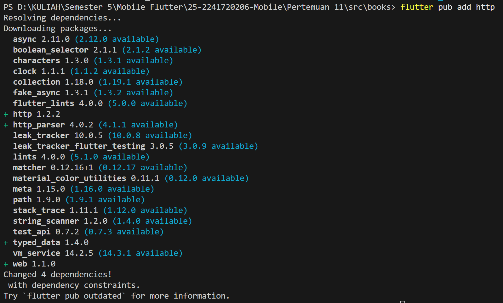


### **Langkah 2: Cek file pubspec.yaml**
Jika berhasil install plugin, pastikan plugin `http` telah ada di file `pubspec` ini seperti berikut.
``` dart
dependencies:
  flutter:
    sdk: flutter
  http: ^1.1.0
```

#### **Pengerjaan:**
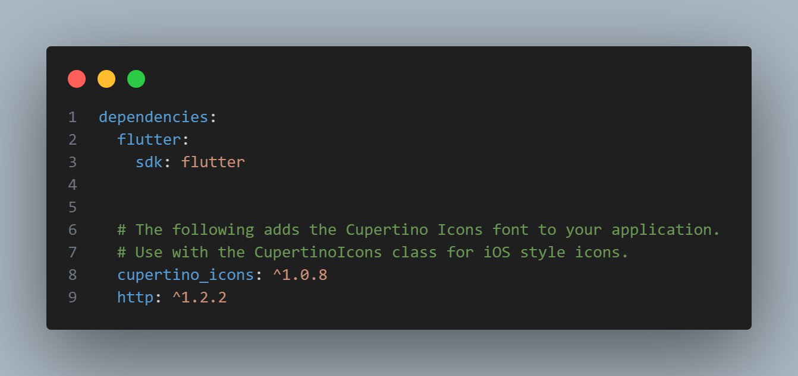


### **Langkah 3: Buka file main.dart**
Ketiklah kode seperti berikut ini.

#### **Pengerjaan:**
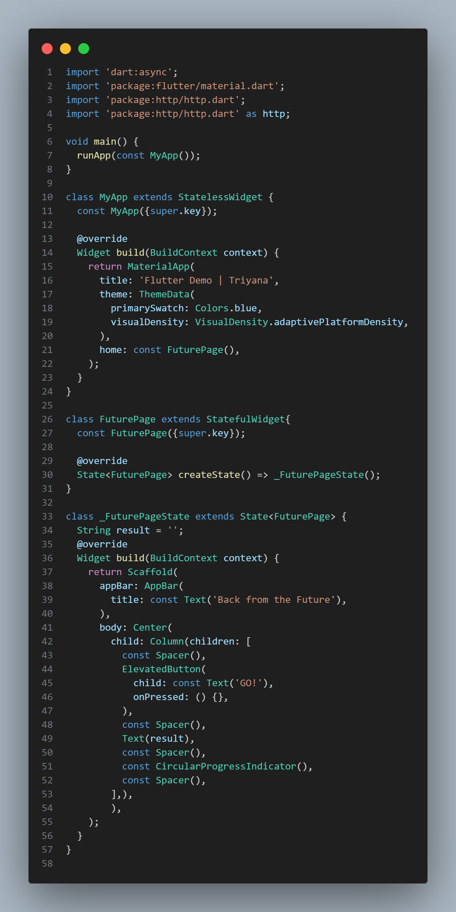


> ### **Soal 1** <br>
> Tambahkan **nama panggilan** Anda pada `title` app sebagai identitas hasil pekerjaan Anda.
> <br>
> #### **Pengerjaan:**
> 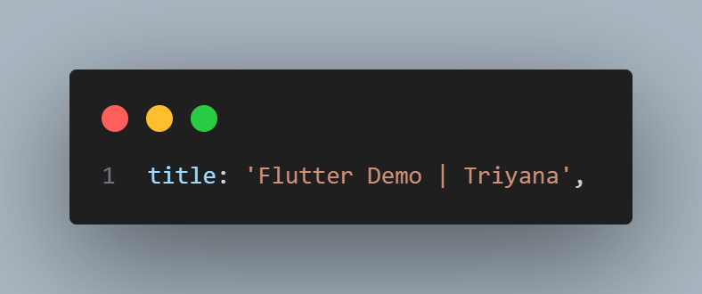

<br>

> **Catatan:** <br>
>
> Tidak ada yang spesial dengan kode di `main.dart` tersebut. Perlu diperhatikan di kode tersebut terdapat widget `CircularProgressIndicator` yang akan menampilkan animasi berputar secara terus-menerus, itu pertanda bagus bahwa aplikasi Anda responsif (tidak freeze/lag). Ketika animasi terlihat berhenti, itu berarti UI menunggu proses lain sampai selesai.


### **Langkah 4: Tambah method getData()**
Tambahkan method ini ke dalam `class _FuturePageState` yang berguna untuk mengambil data dari API Google Books.

#### **Pengerjaan:**
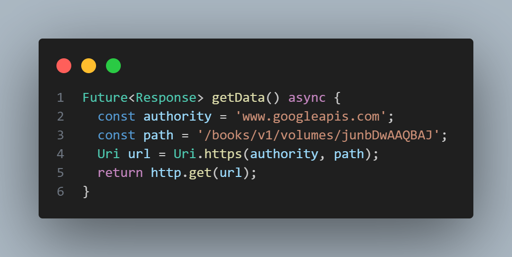


> ### **Soal 2** <br>
> - Carilah judul buku favorit Anda di Google Books, lalu ganti ID buku pada variabel path di kode tersebut. Caranya ambil di URL browser Anda seperti gambar berikut ini. <br>
> 
> - Kemudian cobalah akses di browser URI tersebut dengan lengkap seperti ini. Jika menampilkan data JSON, maka Anda telah berhasil. <br>
> 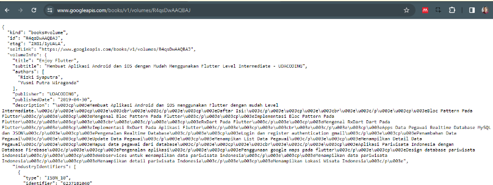 <br>
> #### **Pengerjaan:** <br>
> 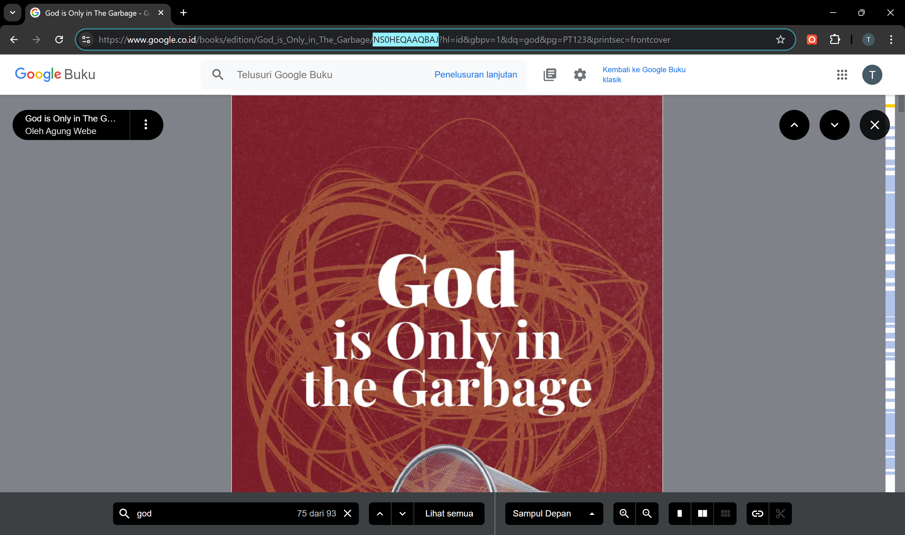
> 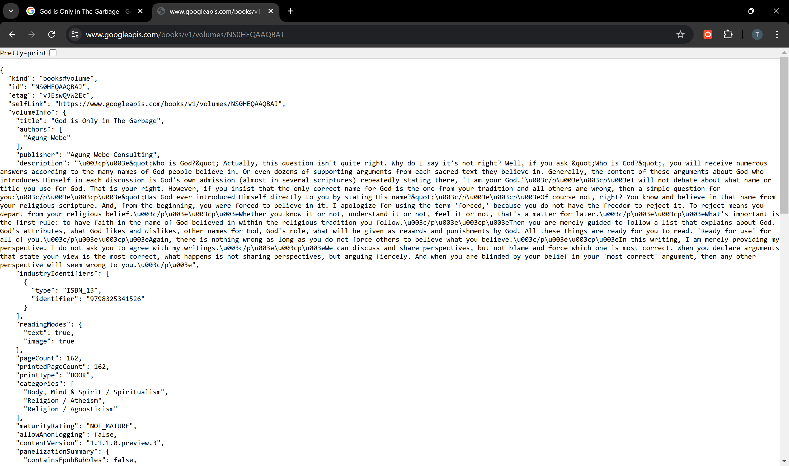


### **Langkah 5: Tambah kode di ElevatedButton**
Tambahkan kode pada onPressed di ElevatedButton seperti berikut.

#### **Pengerjaan:**
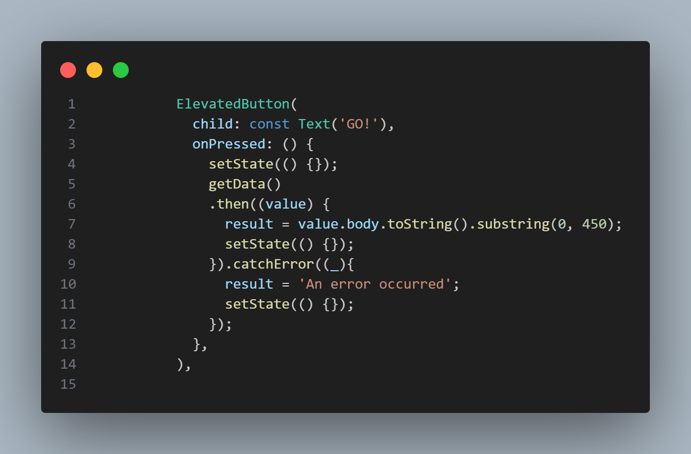

<br>

Lakukan run aplikasi Flutter Anda. Anda akan melihat tampilan akhir seperti gambar berikut. Jika masih terdapat error, silakan diperbaiki hingga bisa running.

## **Hasil Akhir Praktikum 1**

<br>


> ### **Soal 3** <br>
> Jelaskan maksud kode langkah 5 tersebut terkait `substring` dan `catchError`!
> #### **Jawaban:** <br>
> - **substring** digunakan untuk membatasi panjang teks yang ditampilkan, karena data yang dikembalikan dari API bisa sangat panjang. Sebagai contoh pada kode langkah 5 `substring(0, 450)` yang berarti mengambil sebagian dari teks mulai dari indeks ke-0 hingga ke-449 (450 karakter pertama).
> - **catchError** berfungsi menangkap kesalahan (error) yang terjadi selama pemanggilan Future (proses getData()).

---

## **Praktikum 2: Menggunakan await/async untuk menghindari callbacks**
Ada alternatif penggunaan Future yang lebih clean, mudah dibaca dan dirawat, yaitu pola **async/await**. Intinya pada dua kata kunci ini:<br>

- `async` digunakan untuk menandai suatu method sebagai asynchronous dan itu harus ditambahkan di depan kode function.
- `await` digunakan untuk memerintahkan menunggu sampai eksekusi suatu function itu selesai dan mengembalikan sebuah value. Untuk then bisa digunakan pada jenis method apapun, sedangkan await hanya bekerja di dalam method async.
Berikut ini contoh kode perbedaan Future dengan then dan async/await.
<br>

Berikut ini contoh kode perbedaan `Future` dengan `then` dan `async/await`.
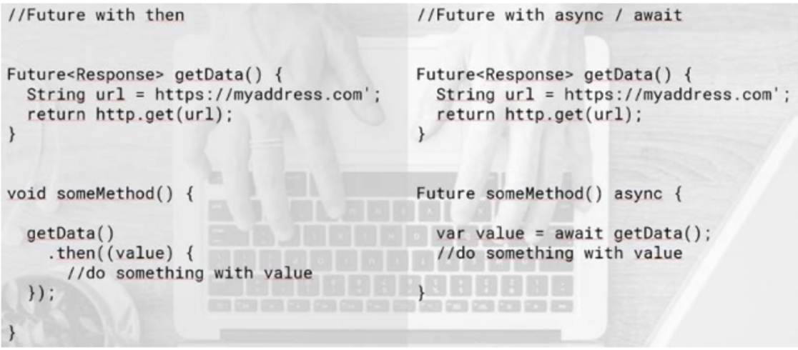

<br>

Pada codelab ini, kita akan menambah kode dari aplikasi **books** di praktikum sebelumnya.

### **Langkah 1: Buka file main.dart**
Tambahkan tiga method berisi kode seperti berikut di dalam `class _FuturePageState`.

#### **Pengerjaan:**
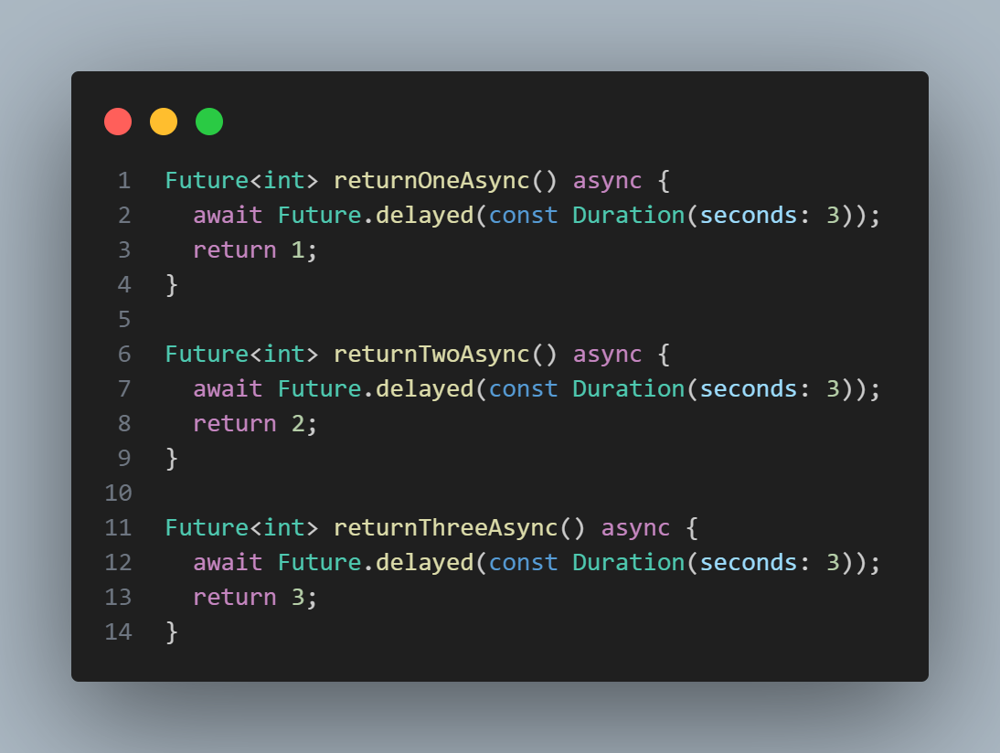


### **Langkah 2: Tambah method count()**
Lalu tambahkan lagi method ini di bawah ketiga method sebelumnya.

#### **Pengerjaan:**
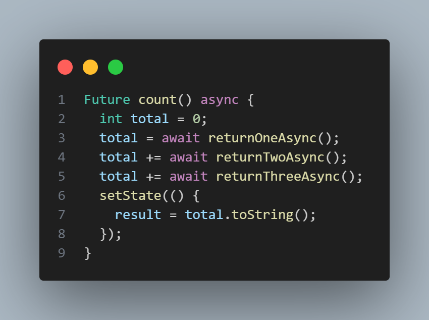


### **Langkah 3: Panggil count()**
Lakukan *comment* kode sebelumnya, ubah isi kode `onPressed()` menjadi seperti berikut.

#### **Pengerjaan:**
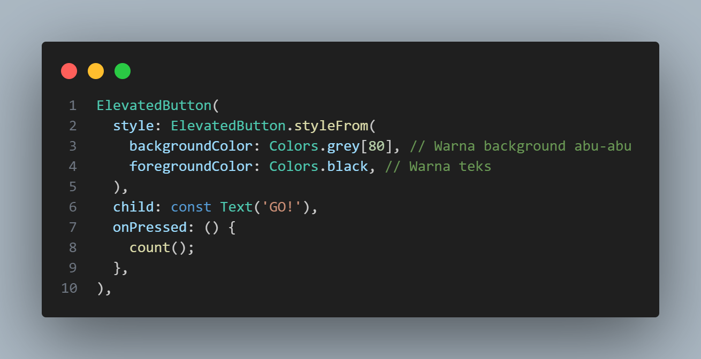


### **Langkah 4: Run**
Akhirnya, **run** atau tekan **F5** jika aplikasi belum running. Maka Anda akan melihat seperti gambar berikut, hasil angka 6 akan tampil setelah delay 9 detik.

#### **Pengerjaan:**


> ### **Soal 4** <br>
> Jelaskan maksud kode langkah 1 dan 2 tersebut! <br>
> #### **Jawaban:**
> **Langkah 1:**
> - Tipe Return Future<int>: <br>
> Method asinkron (async) yang mengembalikan nilai bertipe int di masa depan setelah operasi selesai. <br>
> - Future.delayed: <br>
> Membuat simulasi penundaan selama 3 detik sebelum nilai dikembalikan. Berguna untuk menguji atau mensimulasikan proses yang memerlukan waktu, seperti pengambilan data dari API atau database. <br>
> - Fungsi Masing-Masing Method: <br>
>   - returnOneAsync: Mengembalikan angka 1 setelah 3 detik. <br>
>   - returnTwoAsync: Mengembalikan angka 2 setelah 3 detik. <br>
>   - returnThreeAsync: Mengembalikan angka 3 setelah 3 detik.
> <br>
> <br>
>
> **Langkah 2:**
> - Tipe Return Future: <br>
> Method ini adalah fungsi asinkron tanpa nilai kembalian (void), tetapi tetap berjalan secara asinkron. <br>
> - Menggunakan await: <br>
> await digunakan untuk menunggu hasil masing-masing method (returnOneAsync, returnTwoAsync, returnThreeAsync) sebelum melanjutkan eksekusi ke baris berikutnya.<br>
> Eksekusi berjalan secara sekuensial:
>   - Menunggu 3 detik untuk mendapatkan angka 1.
>   - Menunggu 3 detik lagi untuk angka 2.
>   - Menunggu 3 detik lagi untuk angka 3.
> - Menghitung Total: <br>
> Hasil dari masing-masing method dijumlahkan: <br>
> total = 1 + 2 + 3. <br>
> Totalnya adalah 6 setelah semua proses selesai. <br>
> - Memperbarui UI dengan setState: <br>
> Nilai result diatur menjadi string total (6) menggunakan setState.
Memastikan UI diperbarui dengan nilai terbaru setelah proses selesai. <br>
> <br>
>
> **Ilustrasi Eksekusi** <br>
> - returnOneAsync dijalankan (menunggu 3 detik, menghasilkan 1).
> - returnTwoAsync dijalankan (menunggu 3 detik, menghasilkan 2).
> - returnThreeAsync dijalankan (menunggu 3 detik, menghasilkan 3).
> - Total dihitung: 1 + 2 + 3 = 6.
> - Nilai total (6) ditampilkan di layar. <br>
> - Total waktu eksekusi adalah 9 detik karena proses berjalan berurutan (sekuensial).

---

## **Praktikum 3: Menggunakan Completer di Future**
Menggunakan Future dengan `then`, `catchError`, `async`, dan `await` mungkin sudah cukup untuk banyak kasus, tetapi ada alternatif melakukan operasi async di Dart dan Flutter yaitu dengan `class Completer`.<br>
**Completer** membuat object Future yang mana Anda dapat menyelesaikannya nanti (late) dengan return sebuah value atau error.

### **Langkah 1: Buka main.dart**
Pastikan telah impor package async berikut.

#### **Pengerjaan:**


### **Langkah 2: Tambahkan variabel dan method**
Tambahkan variabel late dan method di `class _FuturePageState` seperti ini.

#### **Pengerjaan:**
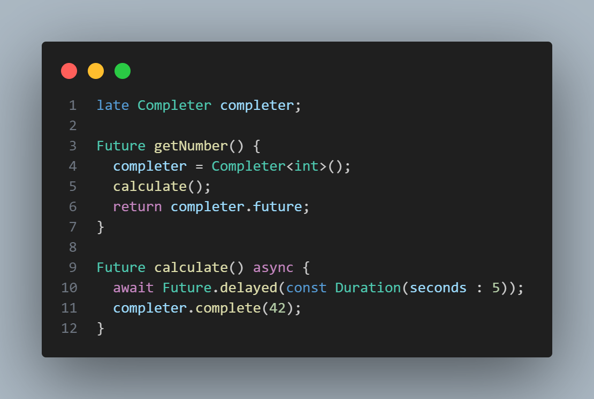


### **Langkah 3: Ganti isi kode onPressed()**
Tambahkan kode berikut pada fungsi `onPressed()`. Kode sebelumnya bisa Anda *comment*.

#### **Pengerjaan:**
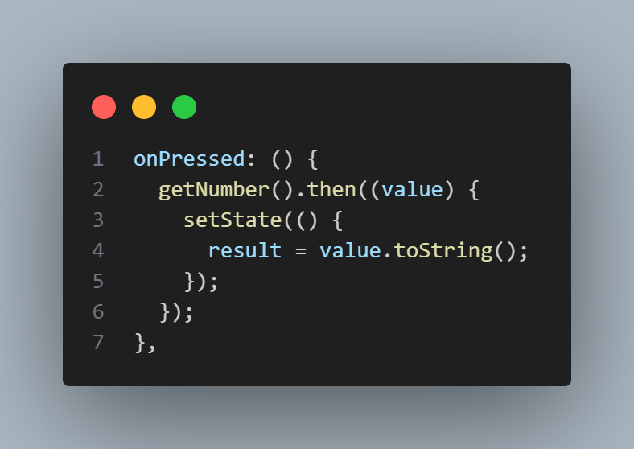


### **Langkah 4:**
Terakhir, **run** atau tekan **F5** untuk melihat hasilnya jika memang belum running. Bisa juga lakukan **hot restart** jika aplikasi sudah running. Maka hasilnya akan seperti gambar berikut ini. Setelah 5 detik, maka angka 42 akan tampil.

#### **Pengerjaan:**
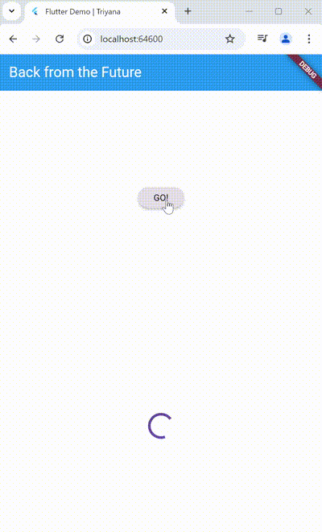


> ### **Soal 5**
> Jelaskan maksud kode langkah 2 tersebut!
>
> #### **Jawaban:**
> Kode pada langkah 2 menambahkan variabel late `completer`, method `getNumber`, dan method `calculate`. <br>
>
> **Completer** adalah kelas di Dart yang digunakan untuk mengontrol penyelesaian (completion) sebuah Future secara manual. Dengan Completer, kita dapat menentukan kapan dan bagaimana sebuah Future selesai, baik dengan nilai sukses (complete) maupun kesalahan (completeError). Variabel completer dideklarasikan sebagai late, yang berarti Variabel akan diinisialisasi nanti sebelum digunakan.
> <br>
>
> **Method getNumber** <br>
> - completer = Completer<int>() <br>
> Membuat instance baru dari Completer yang akan menyelesaikan sebuah Future bertipe int. <br>
> - calculate(); <br>
> Memulai proses perhitungan asinkron. Hasil perhitungan ini akan melengkapi (complete) Future yang dihasilkan oleh Completer. <br>
> - return completer.future; <br>
> Mengembalikan Future yang terkait dengan Completer. Future ini digunakan oleh kode pemanggil untuk menunggu hasil perhitungan.
> <br>
>
> **Method calculate** <br>
> - await Future.delayed <br>
> Mensimulasikan proses yang memakan waktu, seperti perhitungan atau pengambilan data, dengan penundaan 5 detik. <br>
> - completer.complete(42) <br>
> Menyelesaikan Future yang terkait dengan Completer dan memberikan nilai 42 sebagai hasilnya.
> <br>
> <br>
>
> Jadi, **Maksud kode pada langkah 2**:
> 1.  Mensimulasikan proses yang butuh waktu 5 detik (seperti menghitung sesuatu atau mengambil data).
> 2. Menggunakan Completer untuk mengatur kapan hasil proses selesai, sehingga kita bisa memberikan nilai hasil (yaitu angka 42) setelah proses selesai.
> 3. Mengembalikan nilai 42 sebagai hasil operasi setelah 5 detik.


### **Langkah 5: Ganti method calculate()**
Gantilah isi code method `calculate()` seperti kode berikut, atau Anda dapat membuat `calculate2()`

#### **Pengerjaan:**
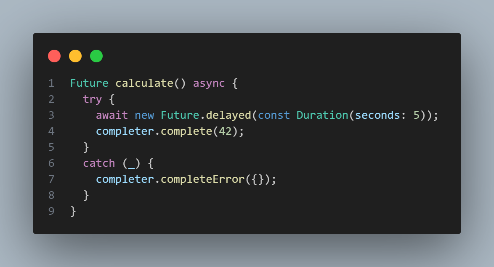


### **Langkah 6: Pindah ke onPressed()**
Ganti menjadi kode seperti berikut.

#### **Pengerjaan:**
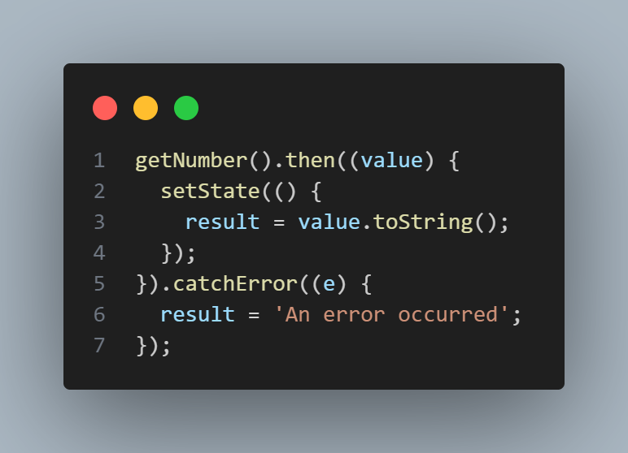


> ### **Soal 6**
> Jelaskan maksud perbedaan kode langkah 2 dengan langkah 5-6 tersebut!
>
> #### **Jawaban:**
> **Langkah 2:** <br>
> - Kode hanya menangani keberhasilan (hasilnya selalu 42).
> - Tidak ada penanganan jika terjadi error. Jika error muncul, aplikasi bisa crash. <br>
>
> **Langkah 5-6:** <br>
> - Menambahkan penanganan error dengan try-catch di calculate.
> - Jika proses gagal, error ditangani dengan completer.completeError, dan catchError akan menampilkan pesan error ke pengguna.
> - Jadi, kode lebih aman dan dapat menangani baik keberhasilan maupun kegagalan. <br>
>
> **Intinya:** Langkah 5-6 membuat kode lebih aman karena dapat menangani keberhasilan maupun kegagalan proses, sehingga aplikasi tetap berjalan dengan baik meskipun terjadi error. Sementara itu, langkah 2 hanya cocok jika proses selalu berhasil, karena tidak ada penanganan error.

## **Hasil Akhir Praktikum 3**

<br>

---

## **Praktikum 4: Memanggil Future secara paralel**
Ketika Anda membutuhkan untuk menjalankan banyak Future secara bersamaan, ada sebuah class yang dapat Anda gunakan yaitu: `FutureGroup`.<br>
`FutureGroup` tersedia di package `async`, yang mana itu harus diimpor ke file dart Anda, seperti berikut.
```dart
import 'package:async/async.dart';
```
> **Catatan**: Package `dart:async` dan `async/async.dart` merupakan library yang berbeda. Pada beberapa kasus, Anda membutuhkan kedua lib tersebut untuk me-run code async.

**FutureGroup** adalah sekumpulan dari Future yang dapat run secara paralel. Ketika run secara paralel, maka konsumsi waktu menjadi lebih hemat (cepat) dibanding run method async secara single setelah itu method async lainnya.<br>
Ketika semua code async paralel selesai dieksekusi, maka FutureGroup akan return value sebagai sebuah `List`, sama juga ketika ingin menambahkan operasi paralel dalam bentuk `List`.

### **Langkah 1: Buka file main.dart**
Tambahkan method ini ke dalam `class _FuturePageState`

#### **Pengerjaan:**
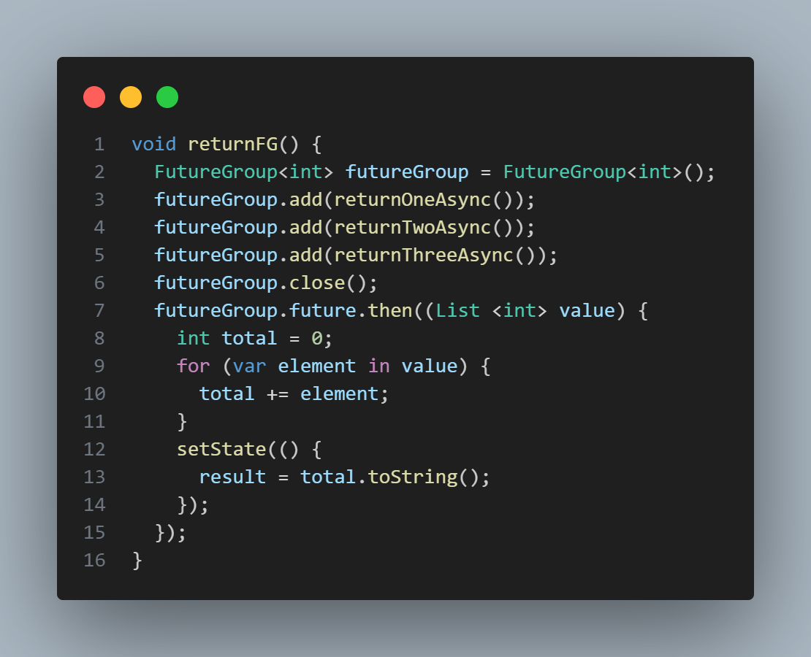


### **Langkah 2: Edit onPressed()**
Anda bisa hapus atau comment kode sebelumnya, kemudian panggil method dari langkah 1 tersebut.

#### **Pengerjaan:**
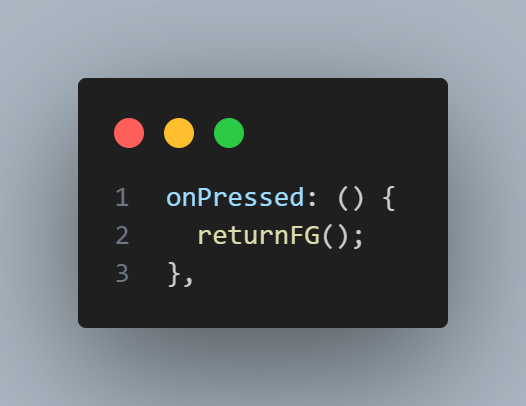


### **Langkah 3: Run**
Anda akan melihat hasilnya dalam 3 detik berupa angka 6 lebih cepat dibandingkan praktikum sebelumnya menunggu sampai 9 detik.

> ### **Soal 7** <br>
> Capture hasil praktikum Anda berupa GIF dan lampirkan di README. <br>
> #### **Pengerjaan:** <br>
> 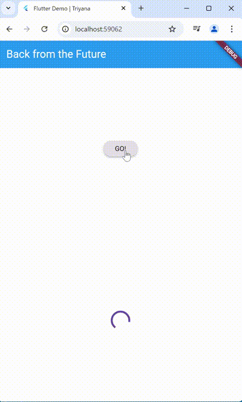


### **Langkah 4: Ganti variabel futureGroup**
Anda dapat menggunakan FutureGroup dengan Future.wait seperti kode berikut.

#### **Pengerjaan:**
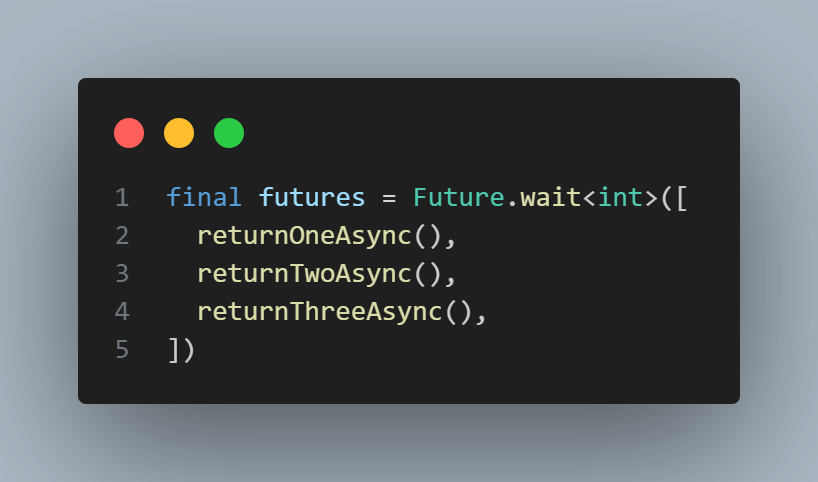


> ### **Soal 8**
> Jelaskan maksud perbedaan kode langkah 1 dan 4! <br>
> #### **Jawaban:** <br>
> **Kode langkah 1:** <br>
> - FutureGroup digunakan untuk mengelola banyak Future dan menunggu hingga semua Future selesai.
> - Menggunakan add untuk menambahkan Future.
> - Harus memanggil close() setelah semua Future ditambahkan agar proses berjalan.
> - Mengembalikan nilai berupa list hasil dari semua Future melalui future. <br>
>
> **Kode langkah 4:** <br>
> - Future.wait langsung menerima list dari semua Future yang ingin ditunggu.
> - Tidak perlu add atau close seperti FutureGroup.
> - Setelah semua Future selesai, hasil dikembalikan sebagai list dari nilai masing-masing Future. <br>
> 
> Jadi, Future.wait lebih sederhana dan langsung digunakan, cocok jika semua proses Future sudah diketahui sejak awal. Sementara itu, FutureGroup lebih fleksibel untuk menambahkan Future secara bertahap, tetapi lebih rumit karena harus menutup grup dengan close().


## **Hasil Akhir Praktikum 4**

<br>

---

## **Praktikum 5: Menangani Respon Error pada Async Code**
Ada beberapa teknik untuk melakukan *handle error* pada code async. Pada praktikum ini Anda akan menggunakan 2 cara, yaitu `then()` callback dan pola `async/await`.

### **Langkah 1: Buka file main.dart**
Tambahkan method ini ke dalam `class _FuturePageState`

#### **Pengerjaan:**
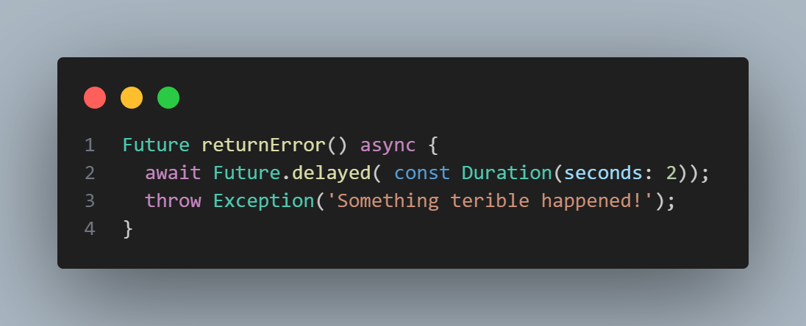


### **Langkah 2: ElevatedButton**
Ganti dengan kode berikut

#### **Pengerjaan:**
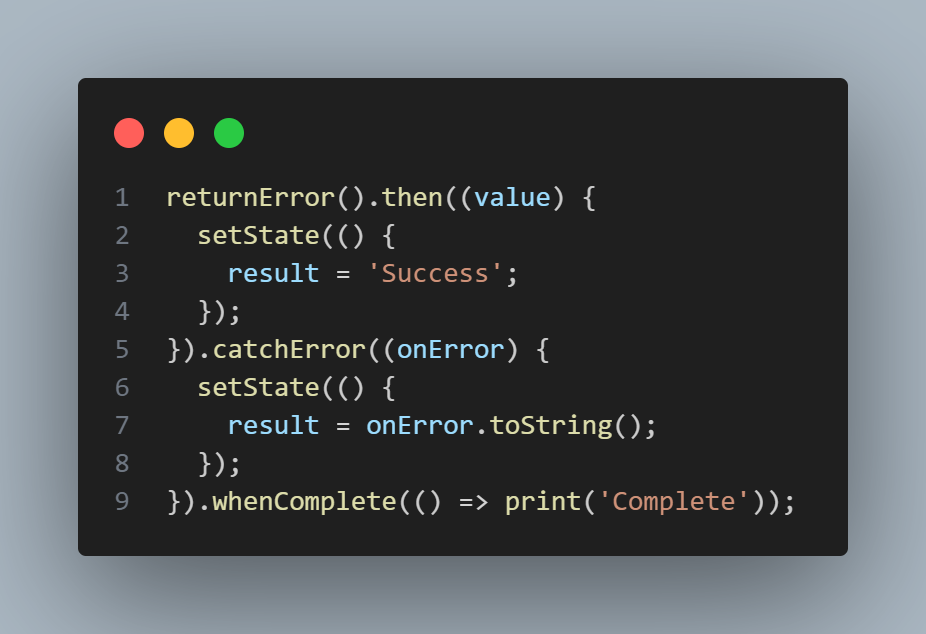


### **Langkah 3: Run**
Lakukan run dan klik tombol GO! maka akan menghasilkan seperti gambar berikut.

#### **Pengerjaan:**
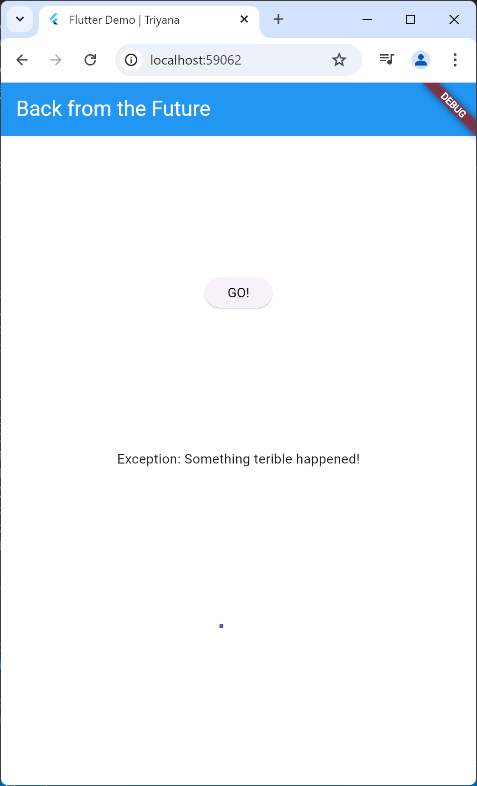 <br>
Pada bagian debug console akan melihat teks `Complete` seperti berikut. <br>
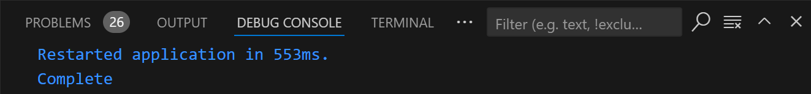


> ### **Soal 9** <br>
> Capture hasil praktikum Anda berupa GIF dan lampirkan di README. <br>
> #### **Pengerjaan:** <br>
> 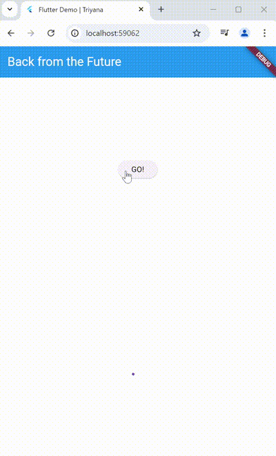


### **Langkah 4: Tambah method handleError()**
Tambahkan kode ini di dalam class _FutureStatePage

#### **Pengerjaan:**
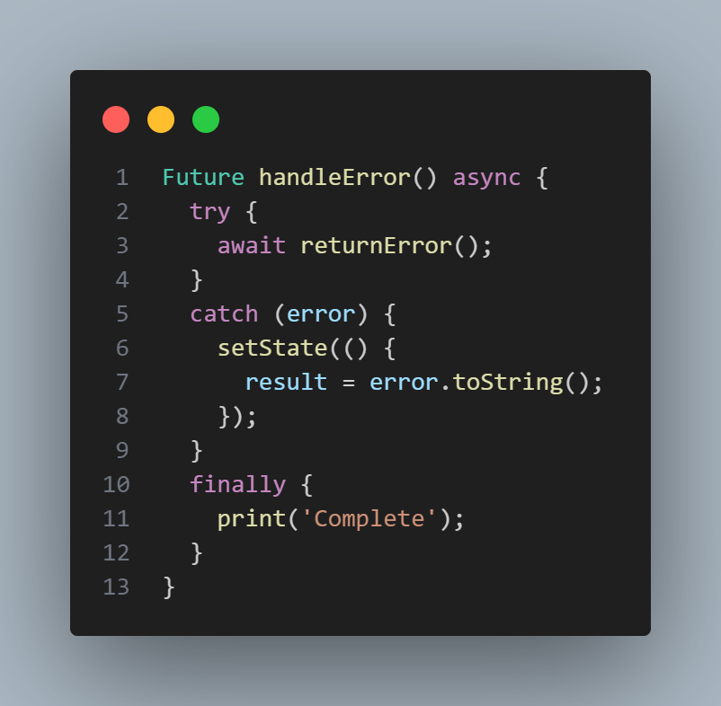


> ### **Soal 10**
> Panggil method handleError() tersebut di ElevatedButton, lalu run. Apa hasilnya? Jelaskan perbedaan kode langkah 1 dan 4!
> #### **Jawaban:** <br>
> 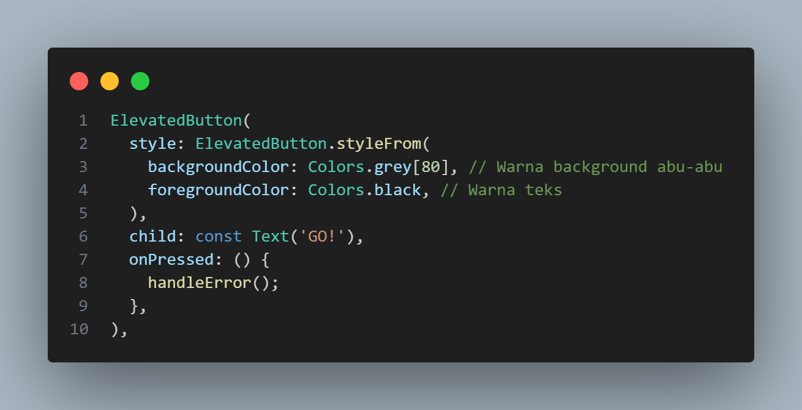 <br>
> Hasil setelah memanggil method handleError() ke ElevatedButton <br>
>  <br>
> <br>
>
> **Perbedaan kode langkah 1 dan 4 :** <br>
> - Langkah 1 membuat method returnError() yang hanya mensimulasikan error dengan menunda proses selama 2 detik, lalu melemparkan pesan error tanpa penanganan. Jika error ini terjadi, aplikasi bisa langsung crash.
> - Langkah 4 menambahkan method handleError() yang bertugas menangkap dan mengelola error dari returnError() menggunakan try-catch-finally. Di sini, error yang terjadi ditangkap di blok catch, lalu hasil error tersebut ditampilkan ke UI menggunakan setState. Blok finally memastikan kode tetap berjalan meskipun ada error, seperti mencetak pesan "Complete". Langkah 4 membuat aplikasi lebih aman dan tetap responsif meskipun ada error.

---

## **Praktikum 6: Menggunakan Future dengan StatefulWidget**
`Stateless` widget tidak dapat menyimpan informasi (state), `StatefulWidget` dapat mengelola variabel dan properti dengan method `setState()`, yang kemudian dapat ditampilkan pada UI. `State` adalah informasi yang dapat berubah selama life cycle widget itu berlangsung.<br>
Ada **4 method utama** dalam life cycle `StatefullWidget`: <br>
- `initState()`: dipanggil sekali ketika state dibangun. Bisa dikatakan ini juga sebagai konstruktor class.
- `build()`: dipanggil setiap kali ada perubahan state atau UI. Method ini melakukan destroy UI dan membangun ulang dari nol.
- `deactive()` dan `dispose()`: digunakan untuk menghapus widget dari tree, pada beberapa kasus dimanfaatkan untuk menutup koneksi ke database atau menyimpan data sebelum berpindah screen.

### **Langkah 1: install plugin geolocator**
Tambahkan plugin geolocator dengan mengetik perintah berikut di terminal.

#### **Pengerjaan:**
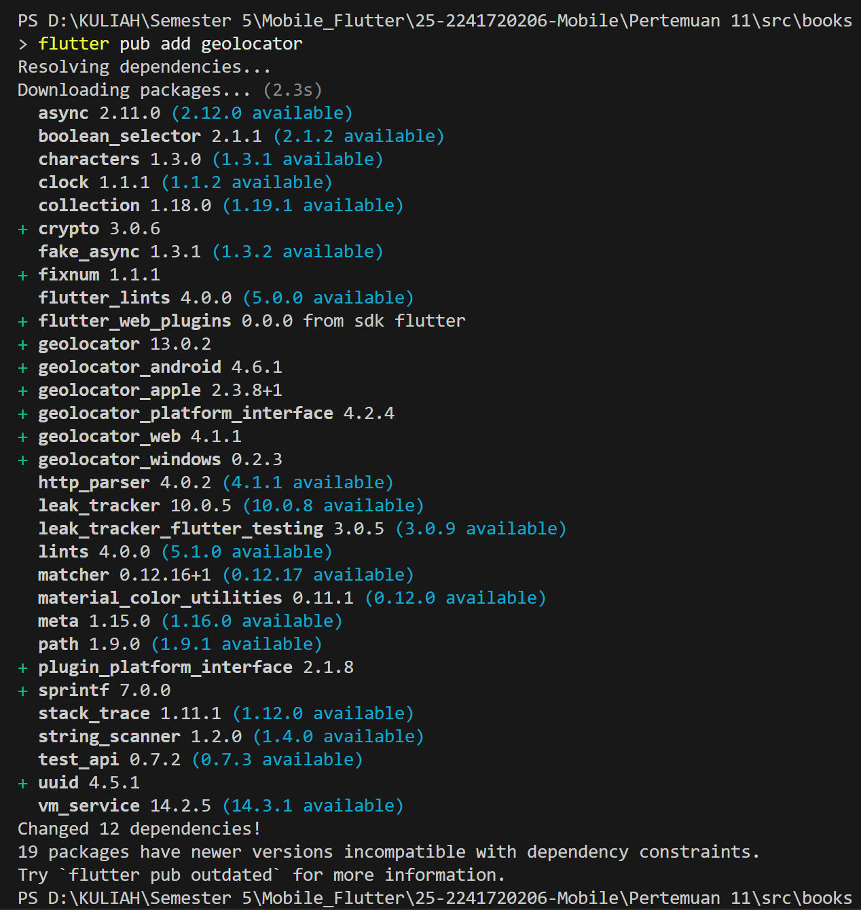


### **Langkah 2: Tambah permission GPS**
Jika Anda menargetkan untuk platform **Android**, maka tambahkan baris kode berikut di file `android/app/src/main/androidmanifest.xml`

#### **Pengerjaan:**
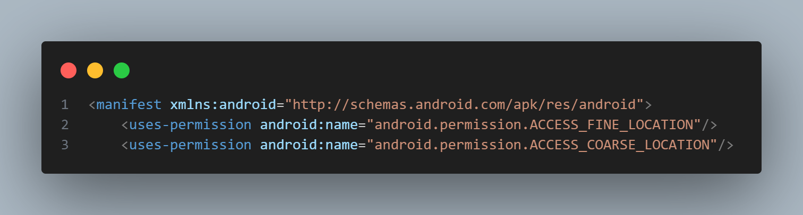


### **Langkah 3: Buat file geolocation.dart**
Tambahkan file baru ini di folder lib project Anda.

#### **Pengerjaan:**
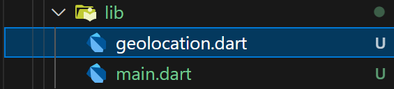


### **Langkah 4: Buat StatefulWidget**
Buat class LocationScreen di dalam file geolocation.dart

### **Langkah 5: Isi kode geolocation.dart**

#### **Pengerjaan:**
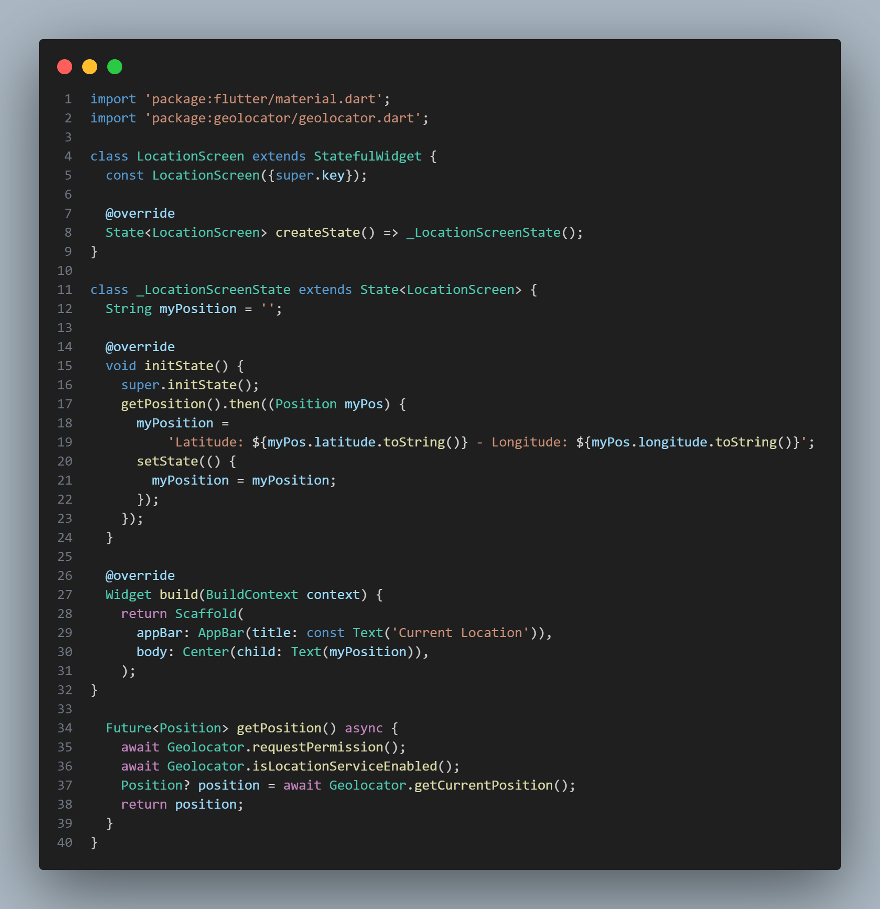


> ### **Soal 11**
> Tambahkan nama panggilan Anda pada tiap properti title sebagai identitas pekerjaan Anda. <br>
>
> #### **Pengerjaan: **
> 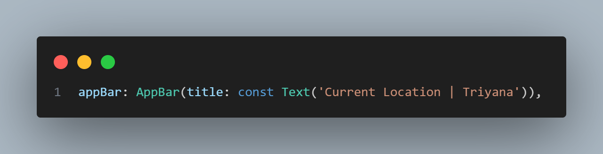


### **Langkah 6: Edit main.dart**
Panggil screen baru tersebut di file main Anda seperti berikut.

#### **Pengerjaan:**
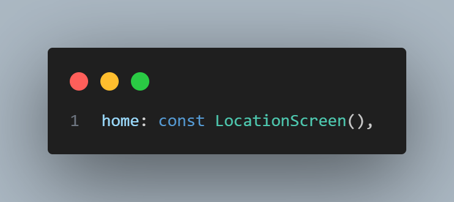


### **Langkah 7: Run**
Run project Anda di **device** atau **emulator** (**bukan browser**), maka akan tampil seperti berikut ini.

#### **Pengerjaan:**


### **Langkah 8: Tambahkan animasi loading**
Tambahkan widget loading seperti kode berikut. Lalu hot restart, perhatikan perubahannya.

#### **Pengerjaan:**
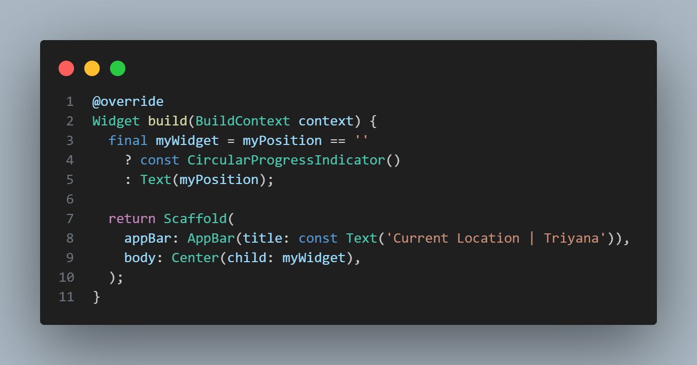


> ### **Soal 12** <br>
> - Apakah Anda mendapatkan koordinat GPS ketika run di browser? Mengapa demikian?
>
> #### **Jawaban:** <br>
> 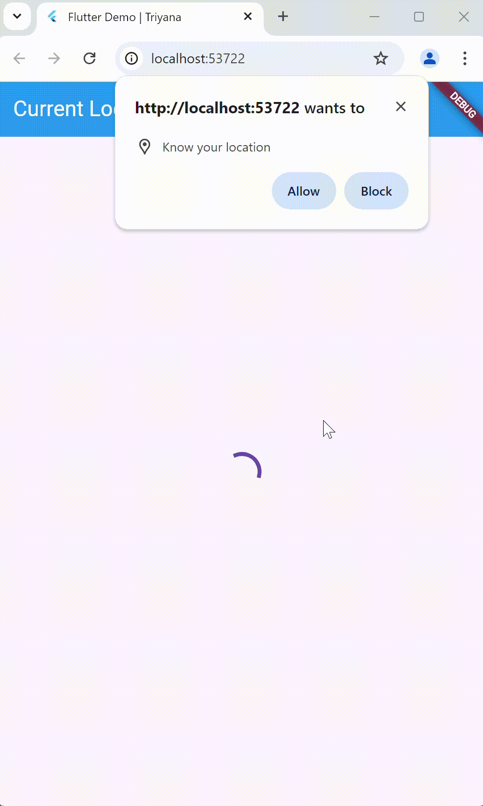 <br>
> Ya, saya bisa mendapatkan koordinat GPS saat menjalankan aplikasi di browser karena browser mendukung fitur geolokasi yang memanfaatkan API lokasi bawaan. API ini menggunakan data dari sumber lain, seperti jaringan Wi-Fi atau lokasi IP, bukan perangkat keras GPS langsung. Oleh karena itu, koordinat tetap dapat diakses meskipun aplikasi berjalan di browser.
> - Capture hasil praktikum Anda berupa GIF dan lampirkan di README. <br>
>
> #### **Pengerjaan:** <br>
> 
> 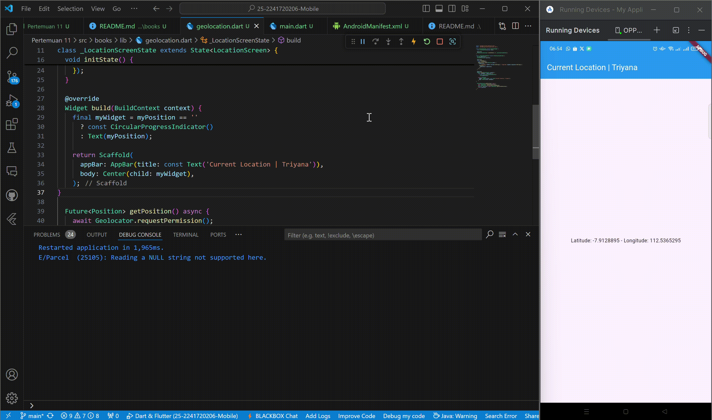 


---

## Praktikum 7: Manajemen Future dengan FutureBuilder
Pola ketika menerima beberapa data secara async dan melakukan update pada UI sebenarnya itu tergantung pada ketersediaan data. Secara umum fakta di Flutter, ada sebuah widget yang membantu Anda untuk memudahkan manajemen future yaitu widget `FutureBuilder`.<br>

Anda dapat menggunakan FutureBuilder untuk manajemen future bersamaan dengan update UI ketika ada update Future. FutureBuilder memiliki status future sendiri, sehingga Anda dapat mengabaikan penggunaan `setState`, Flutter akan membangun ulang bagian UI ketika update itu dibutuhkan. <br>


### **Langkah 1: Modifikasi method getPosition()**
Buka file `geolocation.dart` kemudian ganti isi method dengan kode ini.

#### **Pengerjaan:**
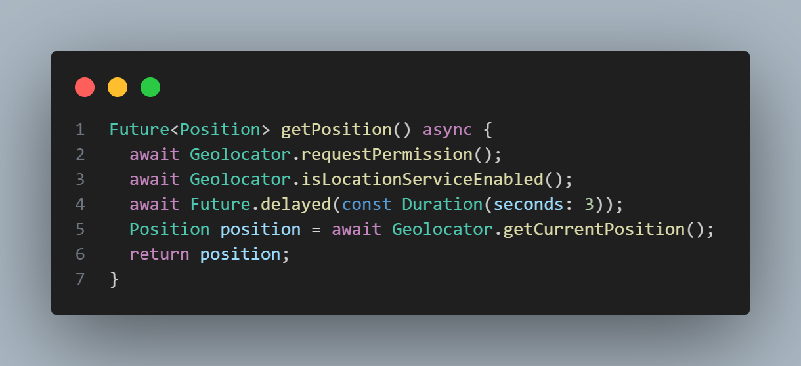


### **Langkah 2: Tambah variabel**
Tambah variabel ini di `class _LocationScreenState`

#### **Pengerjaan:**
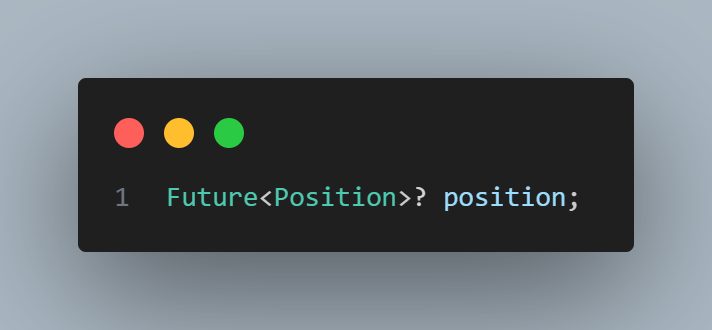


### **Langkah 3: Tambah initState()**
Tambah method ini dan set variabel `position`

#### **Pengerjaan:**
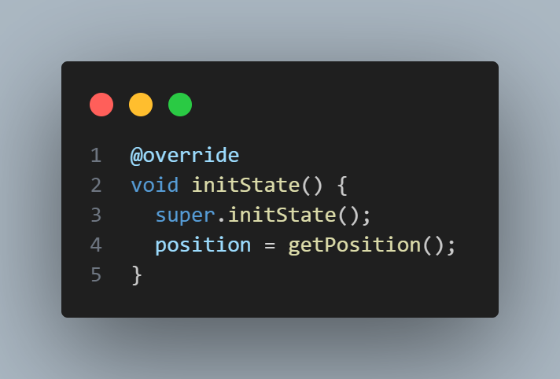


### **Langkah 4: Edit method build()**
Ketik kode berikut dan sesuaikan. Kode lama bisa Anda comment atau hapus.

#### **Pengerjaan:**
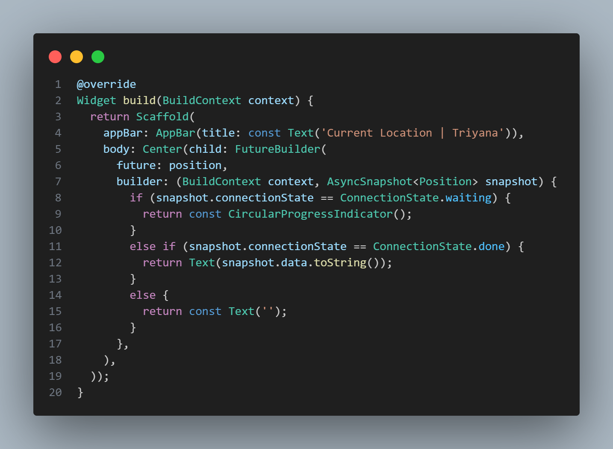


> ### **Soal 13** <br>
> - Apakah ada perbedaan UI dengan praktikum sebelumnya? Mengapa demikian?
> #### **Jawaban:** <br>
> Secara UI tidak ada perbedaan yang terlihat karena kedua kode menampilkan elemen yang sama, seperti CircularProgressIndicator saat loading dan Text untuk menunjukkan hasil lokasi. Struktur tampilan seperti Scaffold, AppBar, dan tata letak juga tidak berubah. Namun, perbedaan utama ada di cara kerja kode di belakang layar, di mana pada praktikum ini menggunakan FutureBuilder untuk mengelola data dan error handling dengan lebih baik. Jadi, meskipun tampilan sama, kode yang diperbaiki lebih rapi, efisien, dan dapat menangani masalah dengan lebih baik. <br>
> - Capture hasil praktikum Anda berupa GIF dan lampirkan di README.
> - Seperti yang Anda lihat, menggunakan FutureBuilder lebih efisien, clean, dan reactive dengan Future bersama UI. <br>
> 
> #### **Pengerjaan:**
>
>  


### **Langkah 5: Tambah handling error**
Tambahkan kode berikut untuk menangani ketika terjadi error. Kemudian hot restart.

#### **Pengerjaan:**
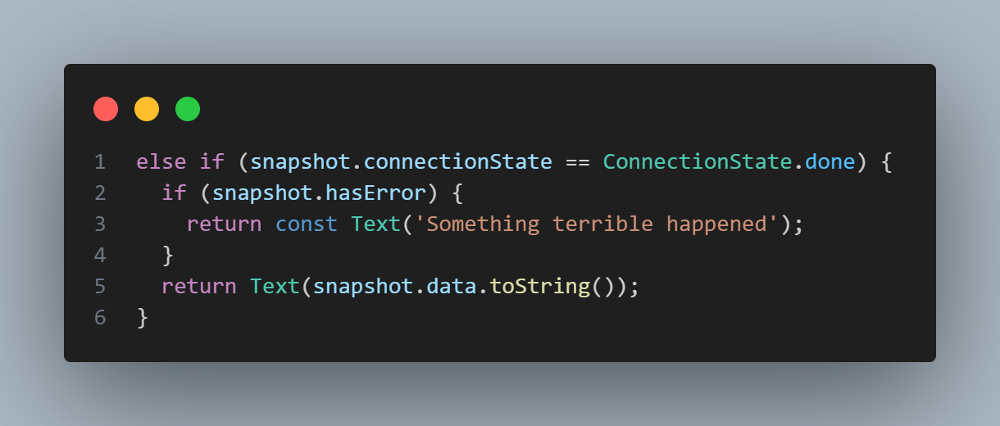


> ### **Soal 14** <br>
> - Apakah ada perbedaan UI dengan langkah sebelumnya? Mengapa demikian?
>
> #### **Jawaban:** <br>
> Setelah menambahkan handling error dan melakukan hot restart, tidak ada perbedaan UI jika tidak terjadi error selama pengambilan lokasi. Aplikasi akan tetap menampilkan CircularProgressIndicator saat loading dan menampilkan data lokasi (latitude dan longitude) saat berhasil. <br>
> Namun, jika terjadi error (misalnya izin lokasi ditolak atau layanan lokasi dimatikan), UI akan menunjukkan teks Something terrible happened!, yang sebelumnya tidak ditangani dan hanya menghasilkan tampilan kosong (Text('')). <br>
> - Capture hasil praktikum Anda berupa GIF dan lampirkan di README. <br>
>
> #### **Pengerjaan:**
>
>  


---

## **Praktikum 8: Navigation route dengan Future Function**
Praktikum kali ini Anda akan melihat manfaat Future untuk Navigator dalam transformasi Route menjadi sebuah function async. Anda akan melakukan push screen baru dan fungsi await menunggu data untuk melakukan update warna background pada screen.

### **Langkah 1: Buat file baru navigation_first.dart**
Buatlah file baru ini di project lib Anda.

#### **Pengerjaan:**
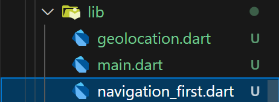


### **Langkah 2: Isi kode navigation_first.dart**

#### **Pengerjaan:**
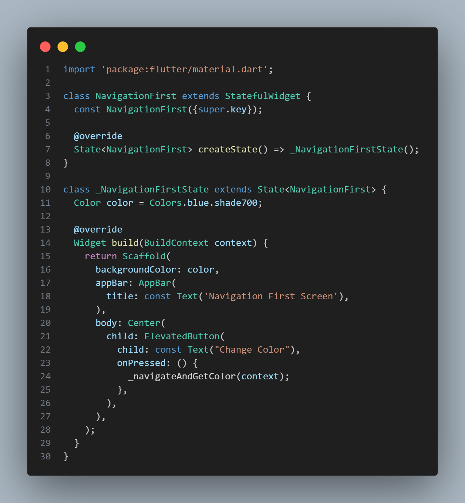


> ### **Soal 15**
> - Tambahkan **nama panggilan Anda** pada tiap properti `title` sebagai identitas pekerjaan Anda.
> - Silakan ganti dengan warna tema favorit Anda. <br>
>
> #### **Pengerjaan:** <br>
> 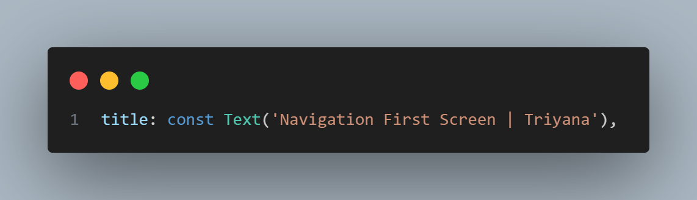
> <br>
> 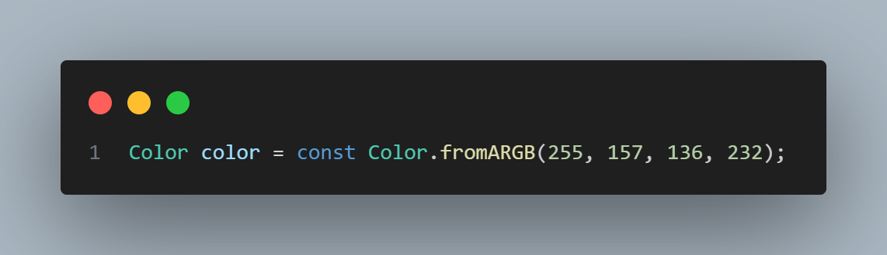


### **Langkah 3: Tambah method di class _NavigationFirstState**
Tambahkan method ini.

#### **Pengerjaan:**
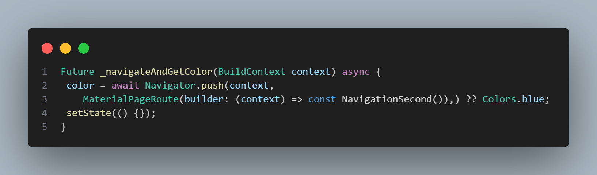


### **Langkah 4: Buat file baru navigation_second.dart**
Buat file baru ini di project lib Anda. Silakan jika ingin mengelompokkan view menjadi satu folder dan sesuaikan impor yang dibutuhkan.

#### **Pengerjaan:**
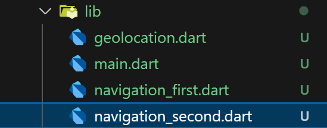


### **Langkah 5: Buat class NavigationSecond dengan StatefulWidget**

#### **Pengerjaan:**
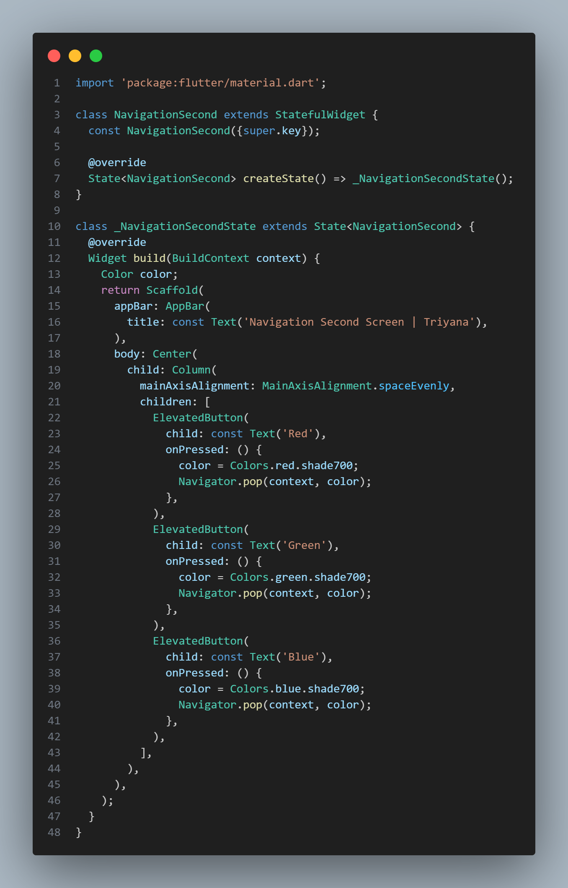


### **Langkah 6: Edit main.dart**
Lakukan edit properti home.

#### **Pengerjaan:**
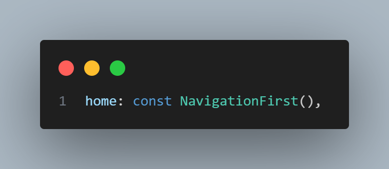


### **Langkah 8: Run**
Lakukan run, jika terjadi error silakan diperbaiki.

#### **Pengerjaan:**


> ### **Soal 16**
> - Cobalah klik setiap button, apa yang terjadi ? Mengapa demikian ?
> 
> #### **Jawaban:** <br>
> Ketika tombol Red, Green, atau Blue di layar kedua diklik, warna yang sesuai (merah, hijau, atau biru) akan dipilih, lalu layar kedua tertutup, dan layar pertama kembali dengan latar belakang yang berubah sesuai warna yang dipilih. Jika tidak memilih warna dan menekan tombol Change Color, layar kedua akan tertutup tanpa mengembalikan warna. <br>
>
> - Gantilah 3 warna pada langkah 5 dengan warna favorit Anda! <br>
>
> #### **Pengerjaan:**
> 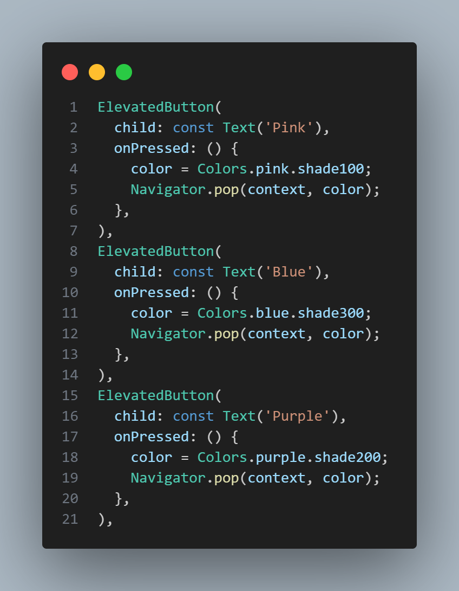 <br>
>
> - Capture hasil praktikum Anda berupa GIF dan lampirkan di README. <br>
> 
> #### **Pengerjaan:** <br>
> 
> 


---


## **Praktikum 9: Memanfaatkan async/await dengan Widget Dialog**
Pada praktikum ini, Anda akan memanfaatkan widget `AlertDialog`. Anda bisa manfaatkan widget ini misal untuk memilih operasi Save, Delete, Accept, dan sebagainya.


### **Langkah 1: Buat file baru navigation_dialog.dart**
Buat file dart baru di folder lib project Anda.

#### **Pengerjaan:**
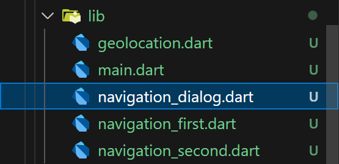


### **Langkah 2: Isi kode navigation_dialog.dart**

#### **Pengerjaan:**
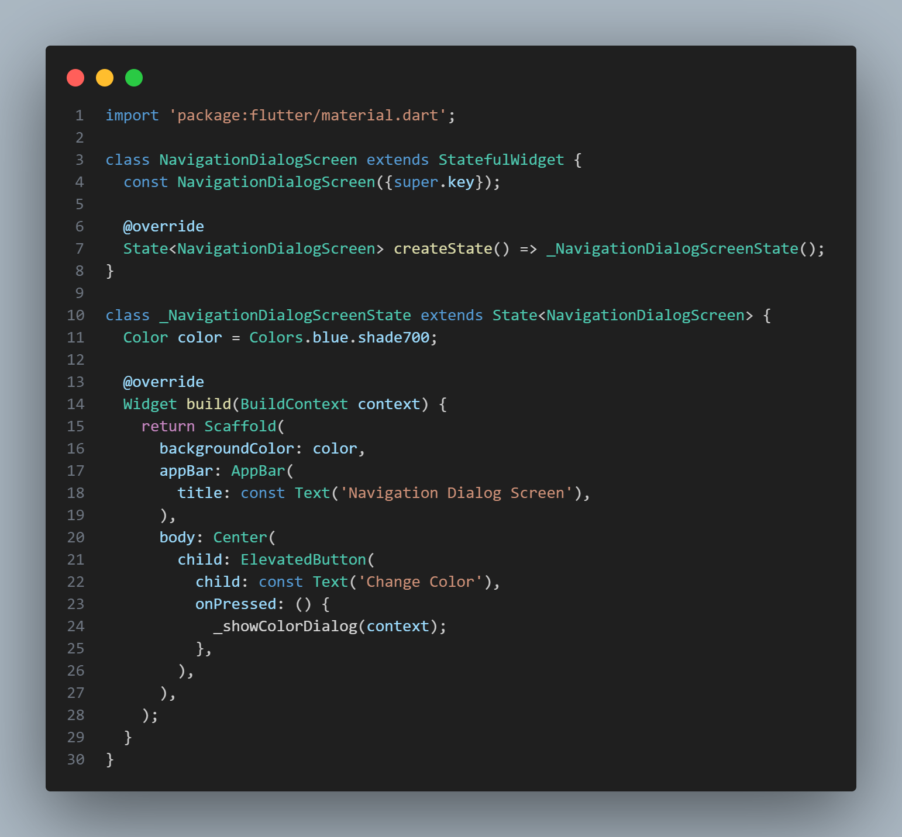


### **Langkah 3: Tambah method async**

#### **Pengerjaan:**
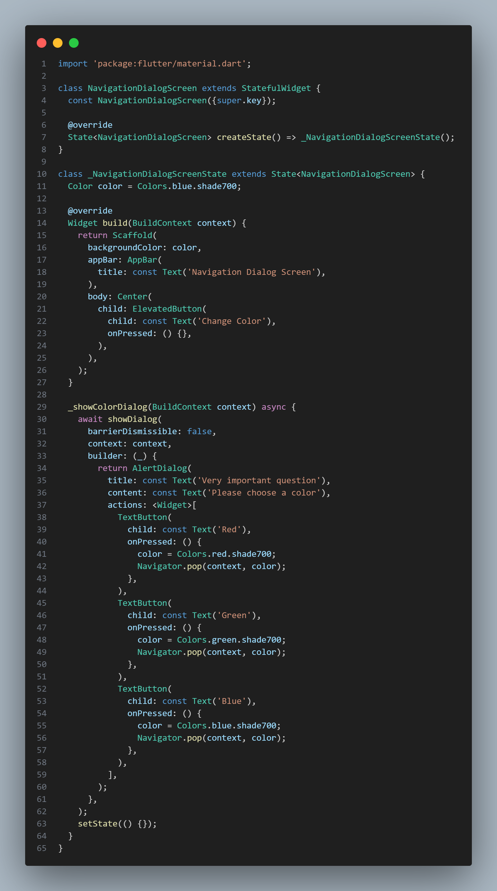


### **Langkah 4: Panggil method di ElevatedButton**

#### **Pengerjaan:**
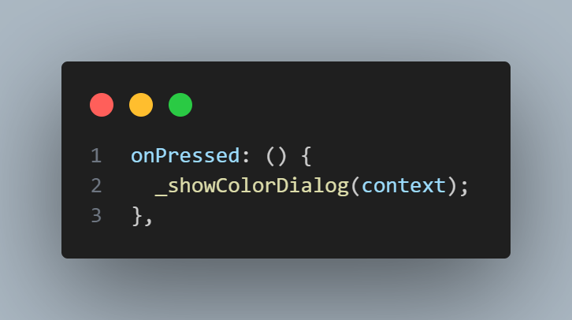


### **Langkah 5: Edit main.dart**
Ubah properti home

#### **Pengerjaan:**
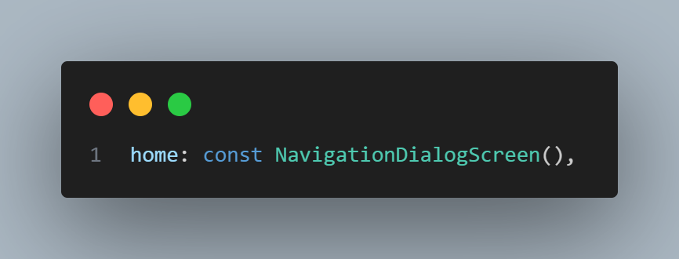


### **Langkah 6: Run**

#### **Pengerjaan:**


> ### **Soal 17**
> - Cobalah klik setiap button, apa yang terjadi ? Mengapa demikian ?
>
> #### **Jawaban:** <br>
> Ketika tombol Red, Green, atau Blue di dialog diklik, warna latar belakang layar utama akan berubah sesuai dengan warna yang dipilih (merah, hijau, atau biru). Setelah memilih warna, dialog akan ditutup dan warna yang dipilih akan dikembalikan ke layar utama. Fungsi setState() kemudian dipanggil untuk memperbarui tampilan layar utama dengan warna baru. Proses ini terjadi karena dialog muncul saat tombol Change Color ditekan, dan menggunakan Navigator.pop untuk menutup dialog dan mengembalikan warna yang dipilih ke layar utama, sehingga tampilan layar utama diperbarui. <br>
>
> - Gantilah 3 warna pada langkah 3 dengan warna favorit Anda!
>
> #### **Pengerjaan:** <br>
> 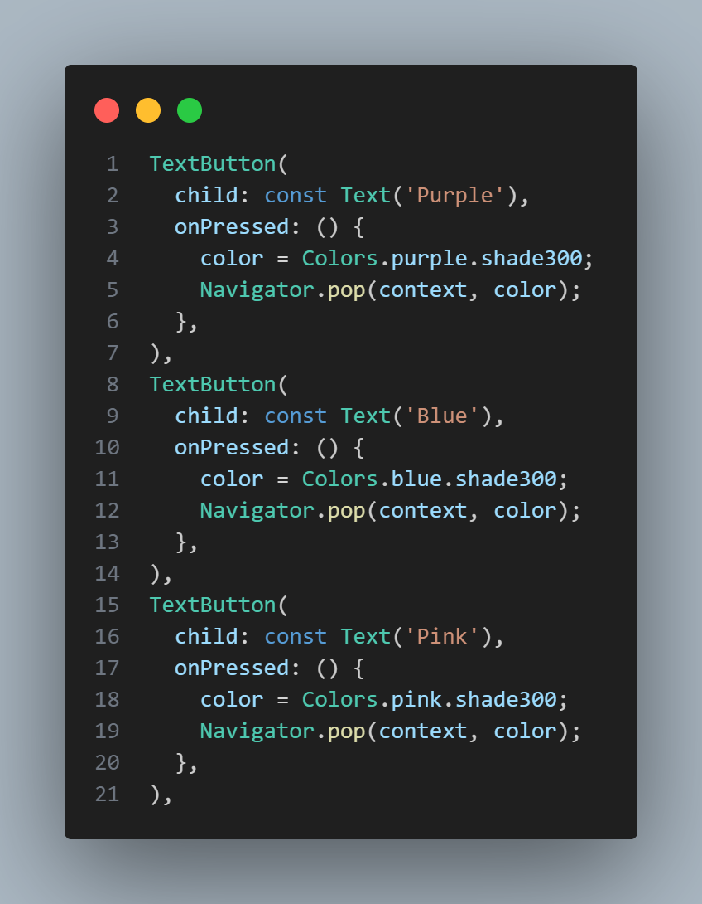 <br>
>
> - Capture hasil praktikum Anda berupa GIF dan lampirkan di README. Lalu lakukan commit dengan pesan "W11: Soal 17". <br>
>
> #### **Pengerjaan:** <br>
>
> 

---