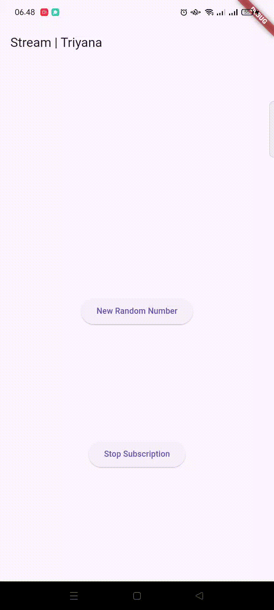

# **Pertemuan 12 | Lanjutan State Management dengan Streams**
## Identitas Mahasiswa

> Nama  : Triyana Dewi Fatmawati  
> NIM   : 2241720206  
> Kelas : TI - 3H  
> Nomor : 25  

---
---

## **Praktikum 1: Dart Streams**
### **Langkah 1: Buat Project Baru**
Buatlah sebuah project flutter baru dengan nama **stream_triyana** (beri nama panggilan Anda) di folder **week-12/src/** repository GitHub Anda.

### **Langkah 2: Buka file main.dart**
Ketiklah kode seperti berikut ini.

#### **Pengerjaan:**

> ### **Soal 1**  
> - Tambahkan **nama panggilan Anda** pada `title` app sebagai identitas hasil pekerjaan Anda.
> - Gantilah warna tema aplikasi sesuai kesukaan Anda. 
> 
> #### **Pengerjaan:**
> 
 

### **Langkah 3: Buat file baru stream.dart**
Buat file baru di folder lib project Anda. Lalu isi dengan kode berikut.

#### **Pengerjaan:**

### **Langkah 4: Tambah variabel colors**
Tambahkan variabel di dalam class `ColorStream` seperti berikut.

#### **Pengerjaan:**

> ### **Soal 2**  
> Tambahkan 5 warna lainnya sesuai keinginan Anda pada variabel `colors` tersebut.  
> 
> #### **Pengerjaan:**
> 
 

### **Langkah 5: Tambah method getColors()**
Di dalam `class ColorStream` ketik method seperti kode berikut. Perhatikan tanda bintang di akhir keyword `async*` (ini digunakan untuk melakukan `Stream` data)

#### **Pengerjaan:**

### **Langkah 6: Tambah perintah yield**
Tambahkan kode berikut ini.

#### **Pengerjaan:**

> ### **Soal 3**  
> - Jelaskan fungsi keyword `yield*` pada kode tersebut!
> - Apa maksud isi perintah kode tersebut?  
> 
> #### **Jawaban:**
> yield* digunakan untuk meneruskan seluruh elemen dari iterable atau stream lain ke dalam stream yang sedang dihasilkan oleh generator function.  
> Kode tersebut menghasilkan stream warna secara periodik setiap 1 detik dengan elemen warna yang dipilih dari daftar colors berdasarkan perhitungan indeks menggunakan operasi modulus. Warna-warna akan terus berulang selama stream aktif.
 

### **Langkah 7: Buka main.dart**
Ketik kode impor file ini pada file `main.dart`

#### **Pengerjaan:**

### **Langkah 8: Tambah variabel**
Ketik dua properti ini di dalam `class _StreamHomePageState`

#### **Pengerjaan:**

### **Langkah 9: Tambah method changeColor()**
Tetap di file main, Ketik kode seperti berikut

#### **Pengerjaan:**

### **Langkah 10: Lakukan override initState()**
Ketika kode seperti berikut

#### **Pengerjaan:**

### **Langkah 11: Ubah isi Scaffold()**
Sesuaikan kode seperti berikut.

#### **Pengerjaan:**

### **Langkah 12: Run**
Lakukan running pada aplikasi Flutter Anda, maka akan terlihat berubah warna background setiap detik.

> ### **Soal 4**  
> Capture hasil praktikum Anda berupa GIF dan lampirkan di README.  
> 
> #### **Pengerjaan:**
> 
 

### **Langkah 13: Ganti isi method changeColor()**
Anda boleh comment atau hapus kode sebelumnya, lalu ketika kode seperti berikut.

#### **Pengerjaan:**

> ### **Soal 5**  
> Jelaskan perbedaan menggunakan `listen` dan `await for` (langkah 9)!  
> 
> #### **Jawaban:**
> `await for` digunakan untuk memproses elemen stream secara berurutan dan menunggu setiap elemen diproses satu per satu, sehingga kode akan terhenti hingga stream selesai. Hal ini cocok untuk stream yang finite atau jika kita ingin memastikan pemrosesan setiap elemen secara sinkron. Sementara itu, `listen` menggunakan pendekatan berbasis callback, di mana setiap elemen stream diproses segera setelah diterima, tanpa menghentikan eksekusi kode lainnya. Pendekatan ini lebih fleksibel, memungkinkan kita untuk menambahkan penanganan error dan notifikasi ketika stream selesai, dan lebih cocok untuk stream yang bersifat infinite atau ketika kita perlu menangani elemen secara bersamaan.
 

> **Catatan:** Stream di Flutter memiliki fitur yang powerfull untuk menangani data secara async. Stream dapat dimanfaatkan pada skenario dunia nyata seperti real-time messaging, unggah dan unduh file, tracking lokasi user, bekerja dengan data sensor IoT, dan lain sebagainya.

---

## **Praktikum 2: Stream controllers dan sinks**
`StreamControllers` akan membuat jembatan antara `Stream` dan `Sink`. `Stream` berisi data secara sekuensial yang dapat diterima oleh subscriber manapun, sedangkan `Sink` digunakan untuk mengisi (injeksi) data.
 
Secara sederhana, StreamControllers merupakan stream management. Ia akan otomatis membuat stream dan sink serta beberapa method untuk melakukan kontrol terhadap event dan fitur-fitur yang ada di dalamnya.
 
Anda dapat membayangkan stream sebagai pipa air yang mengalir searah, dari salah satu ujung Anda dapat mengisi data dan dari ujung lain data itu keluar. Anda dapat melihat konsep stream pada gambar diagram berikut ini. 

  

Di Flutter, Anda dapat menggunakan `StreamController` untuk mengontrol aliran data `stream`. Sebuah `StreamController` memiliki sebuah properti bernama `sink` yang berguna untuk insert data. Sedangkan properti `stream` berguna untuk menerima atau keluarnya data dari `StreamController` tersebut.
 

Pada codelab ini, kita akan menambah kode dari aplikasi stream di praktikum sebelumnya.

### **Langkah 1: Buka file stream.dart**
Lakukan impor dengan mengetik kode ini.

#### **Pengerjaan:**

### **Langkah 2: Tambah class NumberStream**
Tetap di file `stream.dart` tambah class baru seperti berikut.

#### **Pengerjaan:**

### **Langkah 3: Tambah StreamController**
Di dalam `class NumberStream` buatlah variabel seperti berikut.

#### **Pengerjaan:**

### **Langkah 4: Tambah method addNumberToSink**
Tetap di `class NumberStream` buatlah method ini

#### **Pengerjaan:**

### **Langkah 5: Tambah method close()**
#### **Pengerjaan:**

### **Langkah 6: Buka main.dart**
Ketik kode import seperti berikut

#### **Pengerjaan:**

### **Langkah 7: Tambah variabel**
Di dalam `class _StreamHomePageState` ketik variabel berikut

#### **Pengerjaan:**

### **Langkah 8: Edit initState()**
#### **Pengerjaan:**

### **Langkah 9: Edit dispose()**
#### **Pengerjaan:**

### **Langkah 10: Tambah method addRandomNumber()**
#### **Pengerjaan:**

### **Langkah 11: Edit method build()**
#### **Pengerjaan:**

### **Langkah 12: Run**
Lakukan running pada aplikasi Flutter Anda, maka akan terlihat seperti gambar berikut.

#### **Pengerjaan:**

> ### **Soal 6**  
> - Jelaskan maksud kode langkah 8 dan 10 tersebut!
> #### **Jawaban:**
> **Langkah 8:**  
> Berfungsi untuk inisialisasi stream dan listener. Listener akan terus memantau aliran data dari StreamController dan memperbarui antarmuka aplikasi secara real-time setiap kali data baru diterima.
> 
> **Langkah 10:** 
Berfungsi untuk menghasilkan angka acak dan mengirimnya ke stream melalui sink, sehingga listener pada langkah 8 dapat menerima data baru dan menampilkannya kepada pengguna.  
>  
> - Capture hasil praktikum Anda berupa GIF dan lampirkan di README. 
> 
> #### **Pengerjaan:**
> 
 

### **Langkah 13: Buka stream.dart**
Tambahkan method berikut ini.

#### **Pengerjaan:**

### **Langkah 14: Buka main.dart**
Tambahkan method `onError` di dalam `class _StreamHomePageState` pada method `listen` di fungsi `initState()` seperti berikut ini.

#### **Pengerjaan:**

### **Langkah 15: Edit method addRandomNumber()**
Lakukan *comment* pada dua baris kode berikut, lalu ketik kode seperti berikut ini.

#### **Pengerjaan:**

> ### **Soal 7**  
> - Jelaskan maksud kode langkah 13 sampai 15 tersebut!
> #### **Jawaban:**
> **Langkah 13:**  
Menambahkan method addError() di stream.dart untuk mengirim error melalui sink ke stream.
>
> **Langkah 14:**  
Menambahkan penanganan error dengan onError pada listener stream di initState(). Jika terjadi error, aplikasi mengubah nilai lastNumber menjadi -1 sebagai indikator error.
> 
> **Langkah 15:**  
Mengubah fungsi addRandomNumber() untuk mengirim error menggunakan method addError() alih-alih angka acak, sehingga dapat menguji mekanisme penanganan error.  
>  
> - Kembalikan kode seperti semula pada Langkah 15, comment `addError()` agar Anda dapat melanjutkan ke praktikum 3 berikutnya.  
> 
> #### **Pengerjaan:**
> 
 

---

## **Praktikum 3: Injeksi data ke streams**
Skenario yang umum dilakukan adalah melakukan manipulasi atau transformasi data stream sebelum sampai pada UI end user. Hal ini sangatlah berguna ketika Anda membutuhkan untuk filter data berdasarkan kondisi tertentu, melakukan validasi data, memodifikasinya, atau melakukan proses lain yang memicu beberapa output baru. Contohnya melakukan konversi angka ke string, membuat sebuah perhitungan, atau menghilangkan data yang berulang terus tampil.
 
Pada praktikum 3 ini, Anda akan menggunakan `StreamTransformers` ke dalam `stream` untuk melakukan `map` dan filter data.
 

### **Langkah 1: Buka main.dart**
Tambahkan variabel baru di dalam `class _StreamHomePageState`

#### **Pengerjaan:**

### **Langkah 2: Tambahkan kode ini di initState**
#### **Pengerjaan:**

### **Langkah 3: Tetap di initState**
Lakukan edit seperti kode berikut.

#### **Pengerjaan:**

### **Langkah 4: Run**
Terakhir, **run** atau tekan **F5** untuk melihat hasilnya jika memang belum running. Bisa juga lakukan **hot restart** jika aplikasi sudah running. Maka hasilnya akan seperti gambar berikut ini. Anda akan melihat tampilan angka dari 0 hingga 90.

#### **Pengerjaan:**

> ### **Soal 8**  
> - Jelaskan maksud kode langkah 1-3 tersebut!
> #### **Jawaban:**
> **Langkah 1:**  
Membuat variabel transformer sebagai tempat untuk mendefinisikan transformasi data.
>
> **Langkah 2:**
Mendefinisikan transformasi menggunakan StreamTransformer, dengan fungsi:
> 1. handleData: Memanipulasi data (mengalikan nilai dengan 10).
> 2. handleError: Menangani error dengan mengirim nilai -1.
> 3.  handleDone: Menutup alur data saat selesai.  
>
> **Langkah 3:**  
Menggunakan transformer dalam alur stream sehingga data yang diterima oleh listener sudah dimodifikasi atau divalidasi.  
>  
> - Capture hasil praktikum Anda berupa GIF dan lampirkan di README.  
> 
> #### **Pengerjaan:**
> 
 

---

## Praktikum 4: Subscribe ke stream events
Dari praktikum sebelumnya, Anda telah menggunakan method `listen` mendapatkan nilai dari `stream`. Ini akan menghasilkan sebuah `Subscription`. `Subscription` berisi method yang dapat digunakan untuk melakukan `listen` pada suatu event dari `stream` secara terstruktur. 

Pada praktikum 4 ini, kita akan gunakan `Subscription` untuk menangani event dan error dengan teknik praktik baik (*best practice*), dan menutup `Subscription` tersebut.

### **Langkah 1: Tambah variabel**
Tambahkan variabel berikut di `class _StreamHomePageState`

#### **Pengerjaan:**

### **Langkah 2: Edit initState()**
Edit kode seperti berikut ini.

#### **Pengerjaan:**

### **Langkah 3: Tetap di initState()**
Tambahkan kode berikut ini.

#### **Pengerjaan:**

### **Langkah 4: Tambah properti onDone()**
Tambahkan dibawahnya kode ini setelah `onError`

#### **Pengerjaan:**

### **Langkah 5: Tambah method baru**
Ketik method ini di dalam `class _StreamHomePageState`

#### **Pengerjaan:**

### **Langkah 6: Pindah ke method dispose()**
Jika method `dispose()` belum ada, Anda dapat mengetiknya dan dibuat override. Ketik kode ini didalamnya.

#### **Pengerjaan:**

### **Langkah 7: Pindah ke method build()**
Tambahkan button kedua dengan isi kode seperti berikut ini.

#### **Pengerjaan:**

### **Langkah 8: Edit method addRandomNumber()**
Edit kode seperti berikut ini.

#### **Pengerjaan:**

### **Langkah 9: Run**
Anda akan melihat dua button seperti gambar berikut.

#### **Pengerjaan:**

### **Langkah 10: Tekan button ‘Stop Subscription'**
Anda akan melihat pesan di Debug Console seperti berikut.

#### **Pengerjaan:**

> ### **Soal 9**  
> - Jelaskan maksud kode langkah 2, 6 dan 8 tersebut!
> #### **Jawaban:**
> **Langkah 2: initState()**  
Pada langkah ini, aplikasi mendengarkan aliran data stream menggunakan subscription yang disimpan di variabel. Setiap kali ada data baru di stream, aplikasi akan memprosesnya dan memperbarui tampilan UI menggunakan setState().
> 
> **Langkah 6: dispose()**  
Di dalam dispose(), kita menutup stream dengan numberStreamController.close() dan membatalkan Subscription menggunakan subscription.cancel(). Ini mencegah kebocoran memori dengan memastikan tidak ada aliran data yang berjalan setelah widget dihapus.
> 
> **Langkah 8: addRandomNumber()**  
Sebelum menambahkan data baru ke stream, aplikasi memeriksa apakah stream sudah ditutup menggunakan isClosed. Jika stream belum ditutup, data baru akan ditambahkan. Jika stream sudah ditutup, aplikasi akan mengatur nilai lastNumber ke -1 untuk menandakan kesalahan.  
>  
> - Capture hasil praktikum Anda berupa GIF dan lampirkan di README.  
> 
> #### **Pengerjaan:**
> 
 

---

## **Praktikum 5: Multiple stream subscriptions**
Secara default, stream hanya bisa digunakan untuk satu subscription. Jika Anda mencoba untuk melakukan subscription yang sama lebih dari satu, maka akan terjadi error. Untuk menangani hal itu, tersedia **broadcast** stream yang dapat digunakan untuk multiple subscriptions. Pada praktikum ini, Anda akan mencoba untuk melakukan multiple stream subscriptions.

### **Langkah 1: Buka file main.dart**
Ketik variabel berikut di `class _StreamHomePageState`

#### **Pengerjaan:**

### **Langkah 2: Edit initState()**
Ketik kode seperti berikut.

#### **Pengerjaan:**

### **Langkah 3: Run**
Lakukan run maka akan tampil error seperti gambar berikut.

#### **Pengerjaan:**

> ### **Soal 10**  
> Jelaskan mengapa error itu bisa terjadi ?  
> 
> #### **Jawaban:**
> Error terjadi karena stream yang digunakan dalam kode bukan merupakan broadcast stream. Secara default, sebuah stream hanya dapat memiliki satu subscription pada suatu waktu. Ketika kita mencoba untuk membuat subscription kedua (subscription2) pada stream yang sama, Flutter memberikan error karena stream tersebut hanya dapat di-subscribe oleh satu listener.
 

### **Langkah 4: Set broadcast stream**
Ketik kode seperti berikut di method `initState()`

#### **Pengerjaan:**

### **Langkah 5: Edit method build()**
Tambahkan text seperti berikut

#### **Pengerjaan:**

### **Langkah 6: Run**
Tekan button ‘**New Random Number**' beberapa kali, maka akan tampil teks angka terus bertambah sebanyak dua kali.

#### **Pengerjaan:**

> ### **Soal 11**  
> - Jelaskan mengapa hal itu bisa terjadi ?
> #### **Jawaban:**
> Hal ini terjadi karena setelah mengubah stream menjadi broadcast stream pada Langkah 4, stream tersebut dapat mendukung lebih dari satu subscription. Setiap kali tombol "New Random Number" ditekan, event yang dikirimkan ke stream akan diterima oleh kedua subscription (subscription dan subscription2).
>
> Karena kedua subscription mendengarkan stream yang sama, setiap angka yang dihasilkan oleh stream akan diproses dua kali, yaitu satu kali untuk masing-masing subscription. Akibatnya, nilai yang ditampilkan pada Text akan bertambah dua kali lipat setiap kali tombol ditekan, karena setiap event stream diterima oleh kedua subscription secara terpisah.  
>  
> - Capture hasil praktikum Anda berupa GIF dan lampirkan di README.  
> 
> #### **Pengerjaan:**
> 
 

---

## **Praktikum 6: StreamBuilder**
`StreamBuilder` adalah sebuah widget untuk melakukan listen terhadap event dari stream. Ketika sebuah event terkirim, maka akan dibangun ulang semua turunannya. Seperti halnya widget `FutureBuilder` pada pertemuan pekan lalu, `StreamBuilder` berguna untuk membangun UI secara reaktif yang diperbarui setiap data baru tersedia.

### **Langkah 1: Buat Project Baru**
Buatlah sebuah project flutter baru dengan nama **streambuilder_triyana** (beri nama panggilan Anda) di folder **week-12/src/** repository GitHub Anda.

### **Langkah 2: Buat file baru stream.dart**
Ketik kode ini

#### **Pengerjaan:**

### **Langkah 3: Tetap di file stream.dart**
Ketik kode seperti berikut.

#### **Pengerjaan:**

### **Langkah 4: Edit main.dart**
Ketik kode seperti berikut ini.

#### **Pengerjaan:**

### **Langkah 5: Tambah variabel**
Di dalam `class _StreamHomePageState`, ketika variabel ini.

#### **Pengerjaan:**

### **Langkah 6: Edit initState()**
Ketik kode seperti berikut.

#### **Pengerjaan:**

### **Langkah 7: Edit method build()**
#### **Pengerjaan:**

### **Langkah 8: Run**
Hasilnya, setiap detik akan tampil angka baru seperti berikut.

#### **Pengerjaan:**

> ### **Soal 12**  
> - Jelaskan maksud kode pada langkah 3 dan 7 !
> #### **Jawaban:**
> **Pada Langkah 3**, metode getNumbers() dalam kelas NumberStream menghasilkan stream angka acak setiap detik menggunakan Stream.periodic(). Ini memungkinkan pengiriman angka acak secara periodik ke stream yang dapat didengarkan oleh widget lainnya.
>
> **Pada Langkah 7**, StreamBuilder digunakan untuk mendengarkan stream yang dihasilkan oleh numberStream. Ketika stream mengirimkan data, UI diperbarui untuk menampilkan angka terbaru. Jika terjadi error atau belum ada data, StreamBuilder menangani kondisi tersebut dengan menampilkan informasi yang sesuai.  
>  
> - Capture hasil praktikum Anda berupa GIF dan lampirkan di README.  
> 
> #### **Pengerjaan:**
> 
 

---

## **Praktikum 7: BLoC Pattern**
Ketika menggunakan pola BLoC, maka segalanya merupakan stream event. BLoC atau **Business Logic Component** adalah lapisan antara semua sumber data dan UI yang mengonsumsi data itu. Contohnya seperti sumber data dari HTTP layanan web servis atau JSON dari sebuah basis data.
 
Sebuah BLoC menerima stream data dari sumbernya, proses itu membutuhkan logika bisnis Anda, dan return stream data ke subscriber-nya. Perhatikan diagram pola kerja BLoC berikut ini.
 
  
Alasan utama menggunakan BLoC adalah memisahkan logika bisnis aplikasi dengan presentasi UI pada widget, terutama akan sangat berguna ketika aplikasi Anda mulai semakin kompleks dan membutuhkan akses state di berbagai tempat. Hal ini akan membuat semakin mudah dalam menggunakan kode Anda, pada beberapa bagian di aplikasi atau bahkan berbeda aplikasi. Selain itu, BLoC secara independen berdiri sendiri dengan UI, sehingga sangat mudah dilakukan isolasi dalam proses testing.
 
Pada praktikum codelab ini, Anda akan membuat aplikasi sederhana menggunakan BLoC, namun Anda dapat dengan mudah mengembangkannya untuk aplikasi yang lebih besar ruang lingkupnya.

### **Langkah 1: Buat Project baru**
Buatlah sebuah project flutter baru dengan nama **bloc_random_nama**(beri nama panggilan Anda) di folder **week-12/src/** repository GitHub Anda. Lalu buat file baru di folder `lib` dengan nama `random_bloc.dart`

### **Langkah 2: Isi kode random_bloc.dart**
Ketik kode impor berikut ini.

#### **Pengerjaan:**

### **Langkah 3: Buat class RandomNumberBloc()**
#### **Pengerjaan:**

### **Langkah 4: Buat variabel StreamController**
Di dalam `class RandomNumberBloc()` ketik variabel berikut ini

#### **Pengerjaan:**

### **Langkah 5: Buat constructor**
#### **Pengerjaan:**

### **Langkah 6: Buat method dispose()**
#### **Pengerjaan:**

### **Langkah 7: Edit main.dart**
#### **Pengerjaan:**

### **Langkah 8: Buat file baru random_screen.dart**
Di dalam folder `lib` project Anda, buatlah file baru random_screen.dart.

### **Langkah 9: Lakukan impor material dan random_bloc.dart**
Ketik kode ini di file baru `random_screen.dart`

#### **Pengerjaan:**

### **Langkah 10: Buat StatefulWidget RandomScreen**
Buatlah di dalam file `random_screen.dart`

#### **Pengerjaan:**

### **Langkah 11: Buat variabel**
Ketik kode ini di dalam `class _RandomScreenState`

#### **Pengerjaan:**

### **Langkah 12: Buat method dispose()**
Ketik kode ini di dalam `class _StreamHomePageState`

#### **Pengerjaan:**

### **Langkah 13: Edit method build()**
Ketik kode ini di dalam `class _StreamHomePageState`

#### **Pengerjaan:**

 

Run aplikasi, maka Anda akan melihat angka acak antara angka 0 sampai 9 setiap kali menekan tombol `FloactingActionButton`.

> ### **Soal 13**  
> - Jelaskan maksud praktikum ini ! Dimanakah letak konsep pola BLoC-nya ?
> #### **Jawaban:** 
> Praktikum ini bertujuan untuk mengajarkan penggunaan pola BLoC (Business Logic Component) dalam pengembangan aplikasi Flutter.  
> Letak Konsep BLoC-nya dalam Praktikum Ini:  
> 1. **StreamController:**   Di dalam BLoC, ada dua StreamController.
Satu untuk menerima event (perintah untuk menghasilkan angka acak) yang dikirim dari UI.
Satu lagi untuk mengirim data (angka acak yang sudah dihitung) ke UI.
> 2. **Event dan Stream:**  
Ketika pengguna menekan tombol, event dikirim ke BLoC. Di sini, eventnya adalah perintah untuk menghasilkan angka acak (ini terjadi di _generateRandomController).
Setelah BLoC memproses event tersebut (menghasilkan angka acak), angka tersebut dikirimkan melalui stream ke UI (_randomNumberController).
> 3. **Pemrosesan di BLoC:**   Logika untuk menghasilkan angka acak terjadi di dalam BLoC. UI hanya menunggu data (angka acak) dari BLoC, dan ketika data diterima, UI akan menampilkan angka tersebut.  
 
> - Capture hasil praktikum Anda berupa GIF dan lampirkan di README.  
> 
> #### **Pengerjaan:**
> 
 
