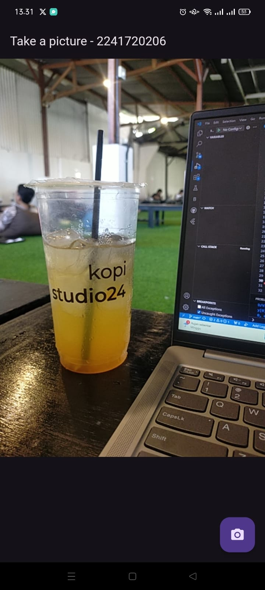
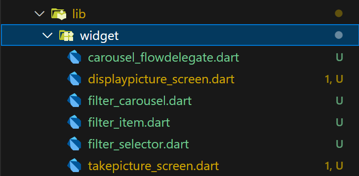
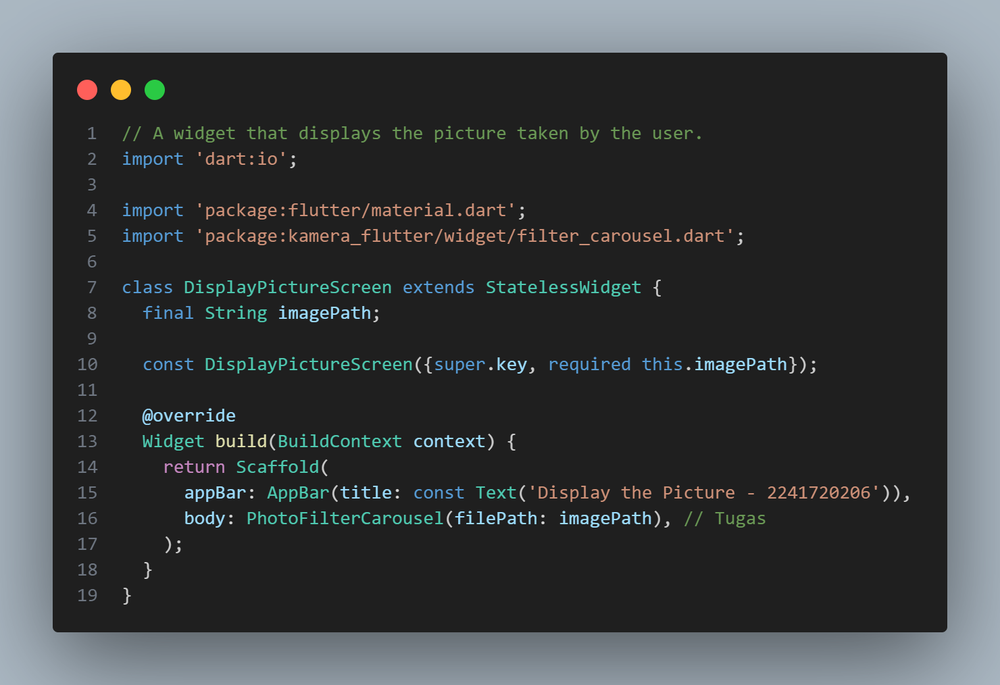
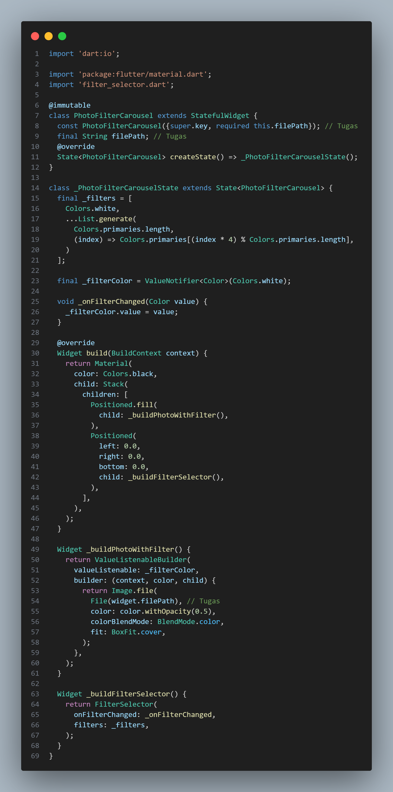

# **Pertemuan 9 | Kamera**
## Identitas Mahasiswa

> Nama  : Triyana Dewi Fatmawati  
> NIM   : 2241720206  
> Kelas : TI - 3H  
> Nomor : 25  

---

## **Tugas**
#### 1. Selesaikan Praktikum 1 dan 2, lalu dokumentasikan dan push ke repository Anda berupa screenshot setiap hasil pekerjaan beserta penjelasannya di file README.md! Jika terdapat error atau kode yang tidak dapat berjalan, silakan Anda perbaiki sesuai tujuan aplikasi dibuat!
#### Pengerjaan:
- **Hasil Praktikum 1**  
     
     
    Setelah icon kamera diklik hasilnya seperti berikut  

     
     

- **Hasil Praktikum 2**  
 

### 2. Gabungkan hasil praktikum 1 dengan hasil praktikum 2 sehingga setelah melakukan pengambilan foto, dapat dibuat filter carouselnya!
#### Pengerjaan:
- **Kode Program**  
    Menambah beberapa file ke folder widget  
    
     

    Melakukan modifikasi pada file displaypicture_screen.dart
    
     

    Melakukan modifikasi pada file filter_carousel.dart
    

- **Hasil**  
 

### 3. Jelaskan maksud void async pada praktikum 1?
#### Jawaban:
Pada praktikum 1, mengubah fungsi `void main()` menjadi `Future<void> main() async` bertujuan untuk memungkinkan fungsi main() menjalankan operasi asynchronous menggunakan await. Tipe `Future<void>` menunjukkan bahwa fungsi ini akan selesai di masa mendatang setelah semua operasi asynchronous selesai, namun tidak akan mengembalikan nilai. Penambahan `async` membuat fungsi dapat menggunakan `await`, yang dalam hal ini diperlukan untuk menunggu hasil dari `availableCameras()`, yaitu proses pengecekan kamera yang membutuhkan waktu.

### 4. Jelaskan fungsi dari anotasi @immutable dan @override ?
#### Jawaban:
- **@immutable** : untuk menandai bahwa suatu kelas bersifat immutable atau tidak dapat diubah setelah dibuat. Artinya, semua properti dari kelas yang ditandai dengan @immutable harus bersifat final atau hanya dapat diinisialisasi satu kali, dan nilainya tidak boleh berubah selama siklus hidup objek. Dalam konteks Flutter, @immutable sering digunakan pada kelas widget yang bersifat stateless (seperti StatelessWidget). 

- **@override** : ketika suatu metode dalam kelas child ingin menggantikan (meng-override) implementasi dari metode yang sama dalam kelas parent-nya. Dengan menandai metode dengan @override, kode menjadi lebih jelas bagi pengembang bahwa fungsi tersebut dimaksudkan untuk mengganti fungsi dari kelas induknya. Anotasi ini sering digunakan pada metode seperti build(), initState(), atau dispose() dalam kelas widget di Flutter untuk menyediakan perilaku khusus di widget tersebut.

### 5. Kumpulkan link commit repository GitHub Anda kepada dosen yang telah disepakati!