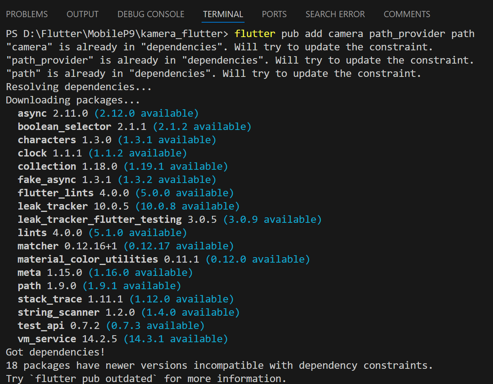
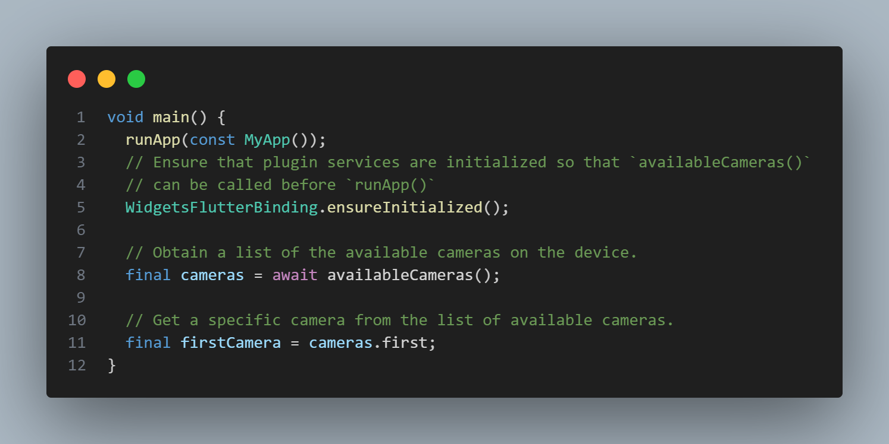
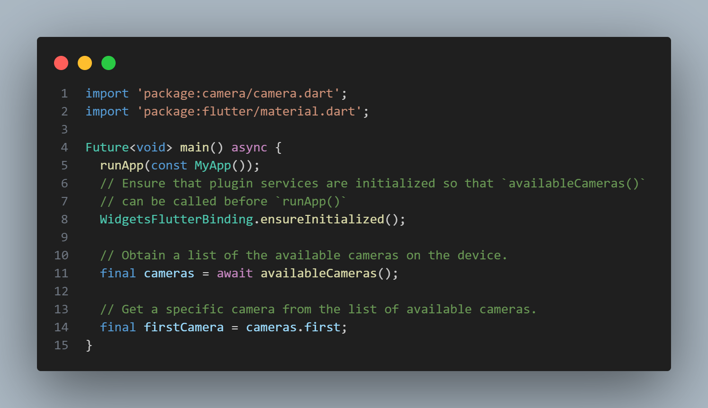
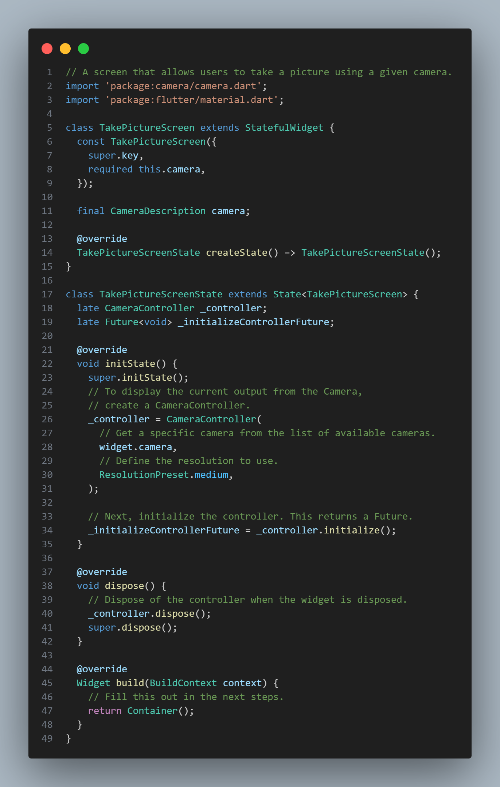
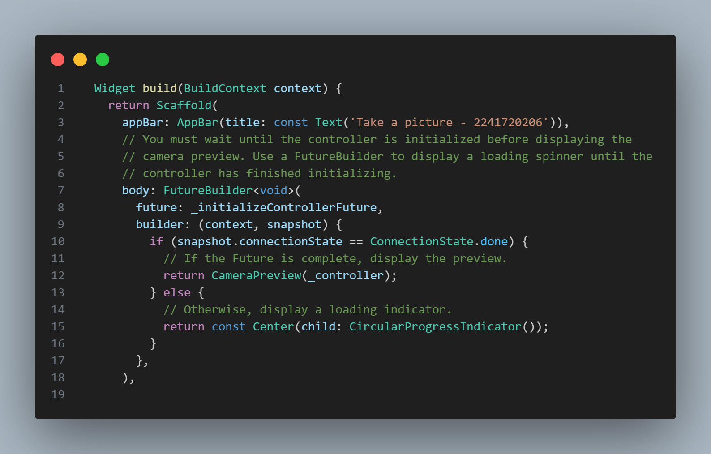
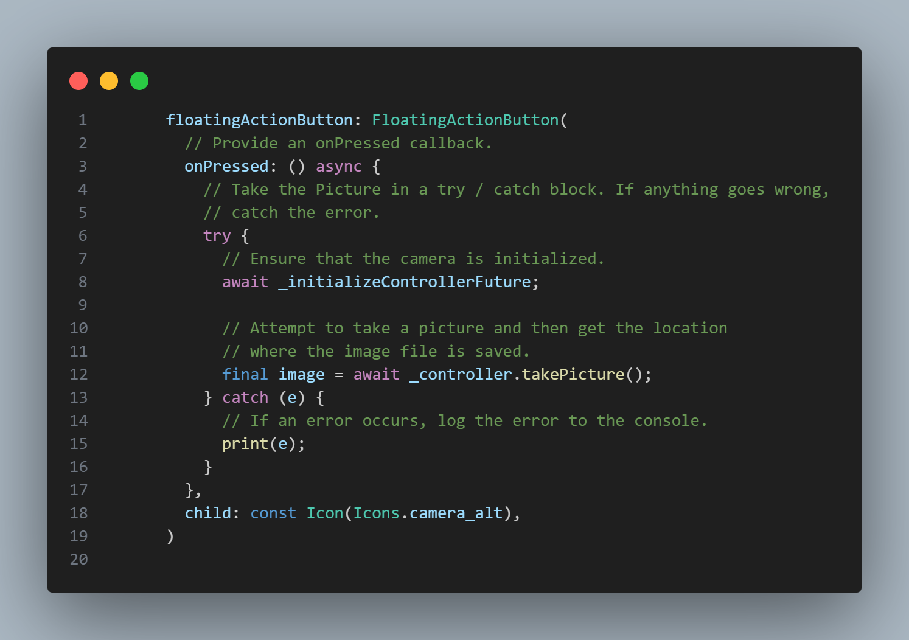
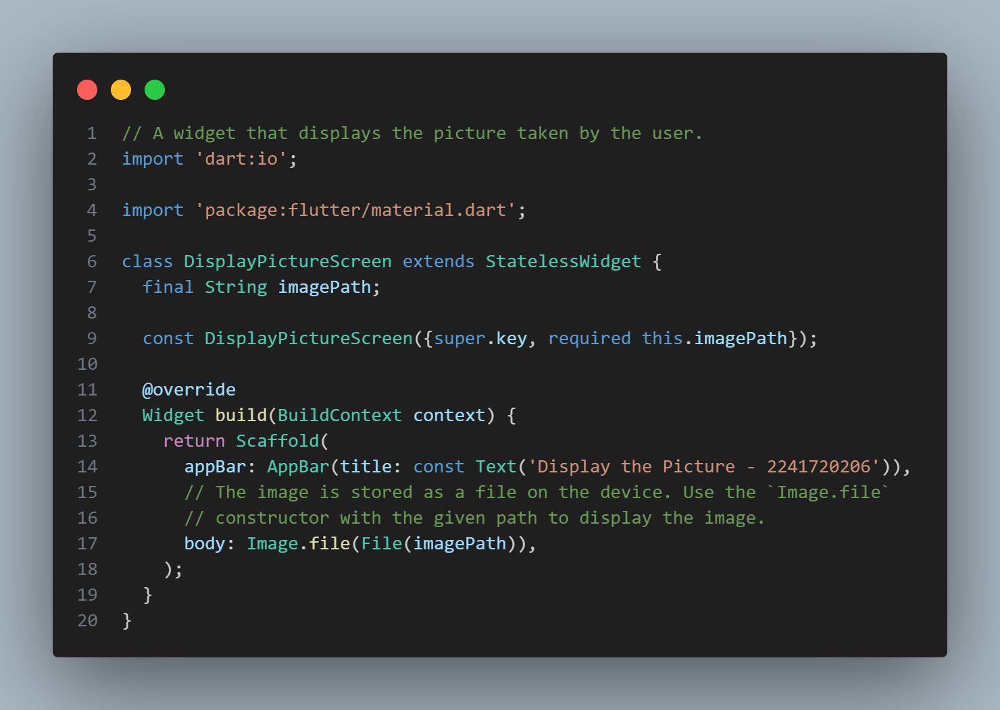
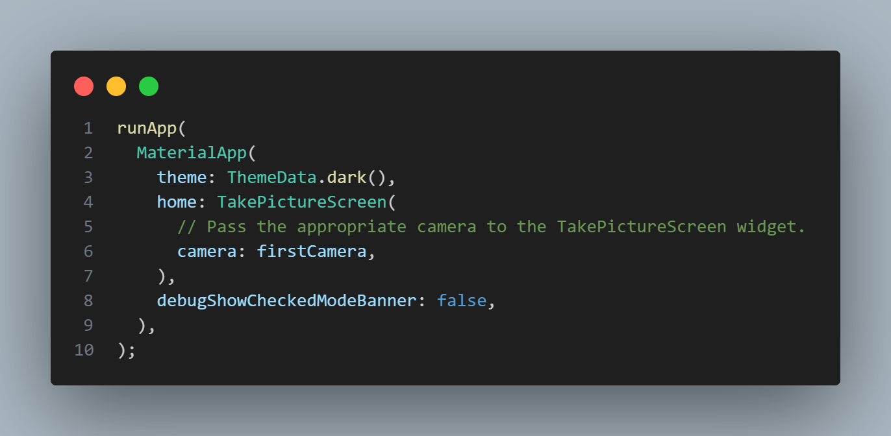
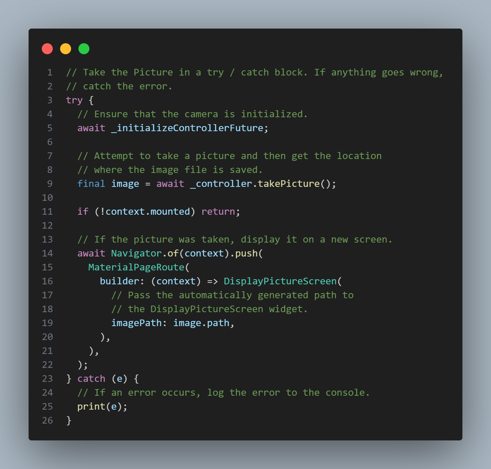

## Identitas Mahasiswa

> Nama  : Triyana Dewi Fatmawati <br/>
> NIM   : 2241720206 <br/>
> Kelas : TI - 3H <br/>
> Nomor : 25 <br/>


## **Praktikum 1: Mengambil Foto dengan Kamera di Flutter**


### **Langkah 1: Buat Project Baru**
Buatlah sebuah project flutter baru dengan nama **kamera_flutter**, lalu sesuaikan style laporan praktikum yang Anda buat.


### **Langkah 2: Tambah dependensi yang diperlukan**
Anda memerlukan tiga dependensi pada project flutter untuk menyelesaikan praktikum ini. <br>
`camera` → menyediakan seperangkat alat untuk bekerja dengan kamera pada device. <br>
`path_provider` → menyediakan lokasi atau path untuk menyimpan hasil foto. <br>
`path` → membuat path untuk mendukung berbagai platform.
<br>

Untuk menambahkan dependensi plugin, jalankan perintah `flutter pub add` seperti berikut di terminal: <br>
``` dart
flutter pub add camera path_provider path
```

> **Tips**
>
> - Untuk Android, Anda harus update variabel `minSdkVersion` = `21` (atau lebih tinggi) pada file `gradle`.
> - Pada iOS, baris kode berikut harus ditambahkan pada file `ios/Runner/Info.plist` untuk mengakses kamera dan microphone.

``` dart
<key>NSCameraUsageDescription</key> 
<string>Explanation on why the camera access is needed.</string>
<key>NSMicrophoneUsageDescription</key>
<string>Explanation on why the microphone access is needed.</string>
```

#### Pengerjaan:


### **Langkah 3: Ambil Sensor Kamera dari device**
Selanjutnya, kita perlu mengecek jumlah kamera yang tersedia pada perangkat menggunakan plugin camera seperti pada kode berikut ini. Kode ini letakkan dalam `void main()`.

#### Pengerjaan:
**lib/main.dart**


Ubah `void main()` menjadi async function seperti berikut ini.
**lib/main.dart**


Pastikan melakukan impor plugin sesuai yang dibutuhkan.


### **Langkah 4: Buat dan inisialisasi CameraController**
Setelah Anda dapat mengakses kamera, gunakan langkah-langkah berikut untuk membuat dan menginisialisasi `CameraController`. Pada langkah berikut ini, Anda akan membuat koneksi ke kamera perangkat yang memungkinkan Anda untuk mengontrol kamera dan menampilkan pratinjau umpan kamera.

1. Buat `StatefulWidget` dengan kelas `State` pendamping.
2. Tambahkan variabel ke kelas `State` untuk menyimpan `CameraController`.
3. Tambahkan variabel ke kelas `State` untuk menyimpan `Future` yang dikembalikan dari `CameraController.initialize()`.
4. Buat dan inisialisasi controller dalam metode `initState()`.
5. Hapus controller dalam metode `dispose()`.

> **Perhatian:** Jika Anda tidak menginisialisasi `CameraController`, Anda tidak dapat menggunakan kamera untuk menampilkan pratinjau dan mengambil gambar.

#### Pengerjaan:
lib/widget/takepicture_screen.dart



### **Langkah 5: Gunakan CameraPreview untuk menampilkan preview foto**
Gunakan widget `CameraPreview` dari package `camera` untuk menampilkan preview foto. Anda perlu tipe objek void berupa `FutureBuilder` untuk menangani proses async.

> **Perhatian:** Pada kode ini Anda perlu logic untuk menunggu controller selesai proses inisialisasi sebelum bekerja dengan kamera. Anda harus menunggu hasil dari method `_initializeControllerFuture()`, yang telah dibuat sebelumnya, agar dapat menampilkan preview foto dengan `CameraPreview`.

#### Pengerjaan:
lib/widget/takepicture_screen.dart



### **Langkah 6: Ambil foto dengan CameraController**
Anda dapat menggunakan `CameraController` untuk mengambil gambar menggunakan metode `takePicture()`, yang mengembalikan objek `XFile`, merupakan sebuah objek abstraksi `File` lintas platform yang disederhanakan. Pada Android dan iOS, gambar baru disimpan dalam direktori cache masing-masing, dan `path` ke lokasi tersebut dikembalikan dalam `XFile`.
<br>

Pada codelab ini, buatlah sebuah `FloatingActionButton` yang digunakan untuk mengambil gambar menggunakan `CameraController` saat pengguna mengetuk tombol.

Pengambilan gambar memerlukan 2 langkah:
1. Pastikan kamera telah diinisialisasi.
2. Gunakan controller untuk mengambil gambar dan pastikan ia mengembalikan objek Future. <br>
Praktik baik untuk membungkus operasi kode ini dalam blok `try / catch` guna menangani berbagai kesalahan yang mungkin terjadi.
<br>

Kode berikut letakkan dalam `Widget build` setelah field `body`.

#### Pengerjaan:
lib/widget/takepicture_screen.dart



### **Langkah 7: Buat widget baru DisplayPictureScreen**
Buatlah file baru pada folder widget yang berisi kode berikut.

#### Pengerjaan:
lib/widget/displaypicture_screen.dart


### **Langkah 8: Edit main.dart**
Edit pada file ini bagian `runApp` seperti kode berikut.

#### Pengerjaan:
lib/main.dart


### **Langkah 9: Menampilkan hasil foto**
Tambahkan kode seperti berikut pada bagian `try / catch` agar dapat menampilkan hasil foto pada `DisplayPictureScreen`.

#### Pengerjaan:
lib/widget/takepicture_screen.dart



### **Hasil Deploy Pada Smartphone**
 
<br>
Setelah icon kamera diklik hasilnya seperti berikut <br>

 