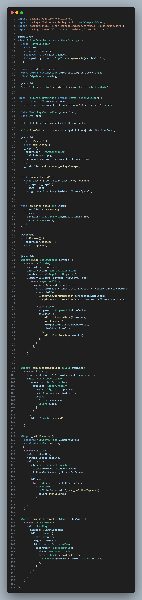
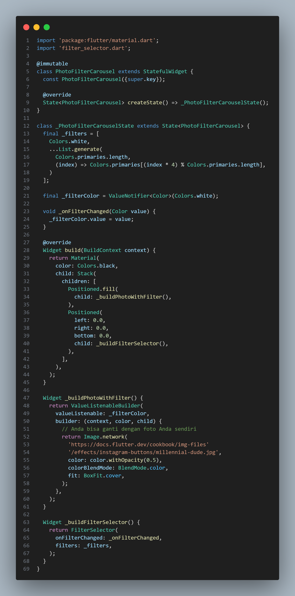
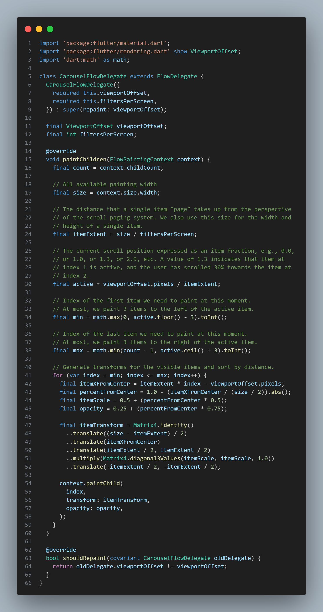
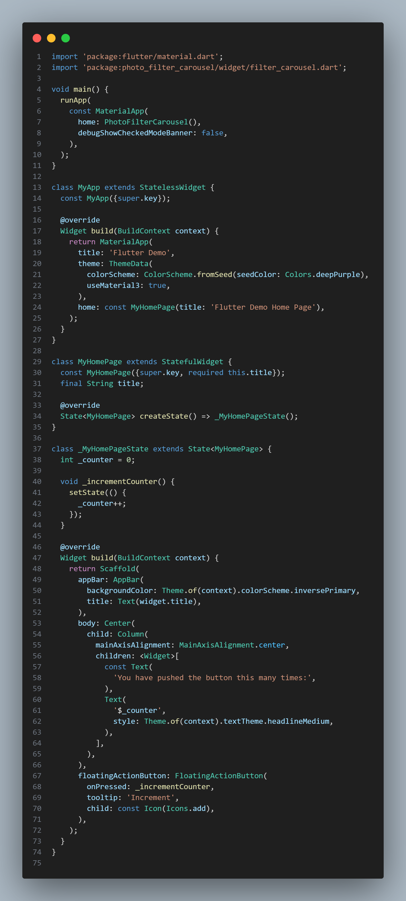

## Identitas Mahasiswa

> Nama  : Triyana Dewi Fatmawati <br/>
> NIM   : 2241720206 <br/>
> Kelas : TI - 3H <br/>
> Nomor : 25 <br/>


## **Praktikum 2: Membuat Photo Filter Carousel**


### **Langkah 1: Buat Project Baru**
Buatlah project flutter baru di pertemuan 09 dengan nama **photo_filter_carousel**


### **Langkah 2: Buat widget Selector ring dan dark gradient**
Buatlah folder widget dan file baru yang berisi kode berikut. <br>

#### Pengerjaan:
**lib/widget/filter_selector.dart**



### **Langkah 3: Buat widget photo filter carousel**
Buat file baru di folder widget dengan kode seperti berikut. <br>

#### Pengerjaan:
**lib/widget/filter_carousel.dart**



### **Langkah 4: Membuat filter warna - bagian 1**
Buat file baru di folder widget seperti kode berikut. <br>

#### Pengerjaan:
**lib/widget/carousel_flowdelegate.dart**



### **Langkah 5: Membuat filter warna**
Buat file baru di folder widget seperti kode berikut ini. <br>

#### Pengerjaan:
**lib/widget/filter_item.dart**


### **Langkah 6: Implementasi filter carousel**
Terakhir, kita impor widget PhotoFilterCarousel ke main seperti kode berikut ini.

#### Pengerjaan:
**lib/main.dart**



### **Hasil Deploy Pada Smartphone**
 


### **Troubleshoot**
Jika diperlukan, beberapa widget yang telah Anda buat sebelumnya, memerlukan kode import berikut ini.
``` dart
import 'dart:math' as math;

import 'package:flutter/material.dart';
import 'package:flutter/rendering.dart' show ViewportOffset;
```